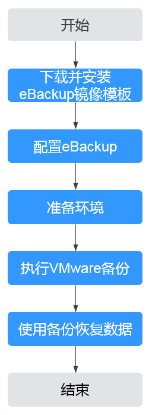

# VMware备份操作流程

VMware备份操作流程如[图1](#fig2797188183412)所示。

**图 1**  VMware备份操作流程  

1.  下载并安装eBackup镜像模板：进行VMware虚拟机备份前必须要先下载eBackup镜像，相关操作请参见[下载eBackup镜像模板](下载eBackup镜像模板.md)和[安装eBackup](安装eBackup.md)。
2.  配置eBackup：安装eBackup后，需要对eBackup进行配置，相关操作请参见[配置eBackup](配置备份服务器.md)。
3.  准备环境：配置完成eBackup后，需要[增加VMware受保护环境](增加VMware受保护环境.md)，同时在控制台购买混合云备份存储库后，在eBackup中完成存储单元、存储池和存储库的创建，相关操作请参见[准备备份存储环境](购买云备份存储库.md)。
4.  执行VMware备份：完成准备工作后，可进行VMware备份，相关操作请参见[VMware备份](创建保护集.md)。
5.  使用备份恢复数据：可以使用备份将虚拟机磁盘恢复到原虚拟机或其他虚拟机，也可以将备份同步至云上，在云上使用备份恢复至云上服务器中。相关操作请参见[恢复VMware虚拟机数据](恢复虚拟机磁盘到原虚拟机.md)。

