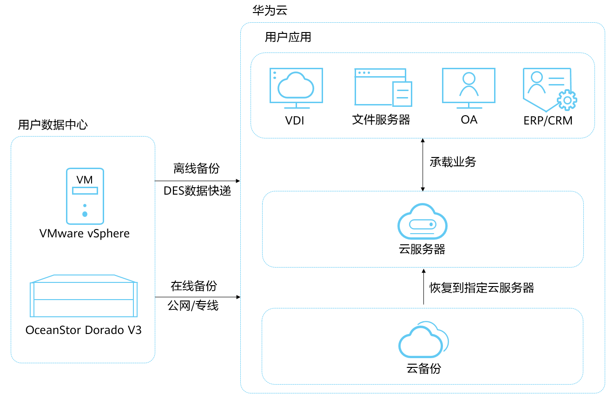

# 什么是混合云备份

## 混合云备份简介

云备份支持同步线下备份存储OceanStor Dorado阵列中以及VMware虚拟机的备份数据，您可以在云上对备份数据进行管理，并支持利用备份数据恢复至云上其他服务器中。

云备份中的混合云备份分为两种：

-   存储备份：支持同步线下备份存储OceanStor Dorado阵列中的备份数据。
-   VMware备份：支持同步线下VMware虚拟机的备份数据。

当发生数据中心级别的灾难或者光纤网络故障等事件时，可以在公有云上通过备份数据快速创建云服务器，缩短业务中断时间。同时可以根据需要，将备份数据复制至其他区域，实现云上业务快速部署。

**图 1**  混合云备份架构图  

## 产品优势

-   按需付费、弹性扩展，有效降低成本

    自建灾备中心，初始投资成本高、建设周期慢、部署周期长、人力消耗大。

-   支持备份上云，云下或云上恢复，实现灾备上云

    传统备份软件，大部分不支持云上恢复为云服务器。

-   云上恢复为云服务器时，发放时间可以缩短至分钟级

    从线下数据中心搬迁上云，或者在云内不同Region迁移业务的用户，需要重新发放新云服务器，并手工配置软件、域名，调测系统，周期很长。

