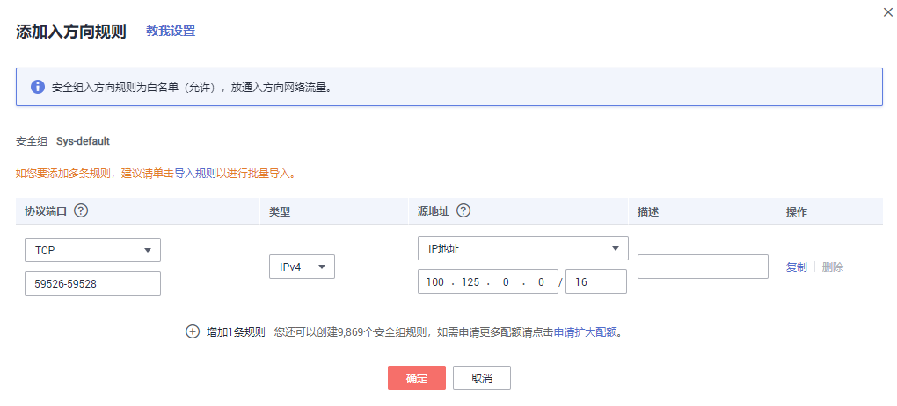
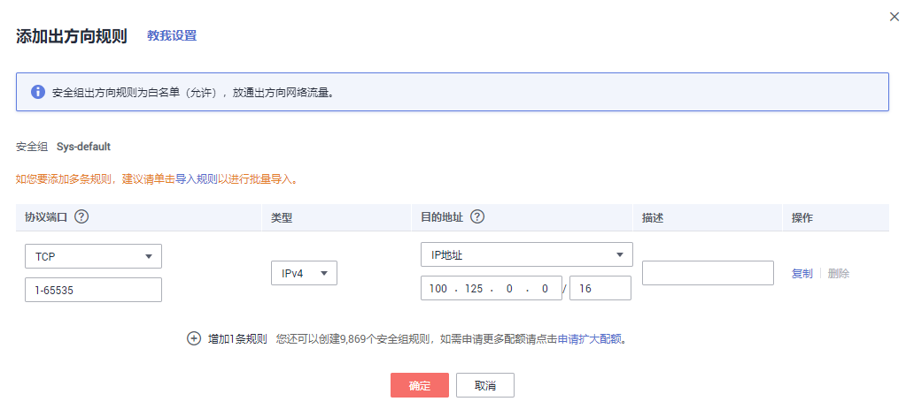
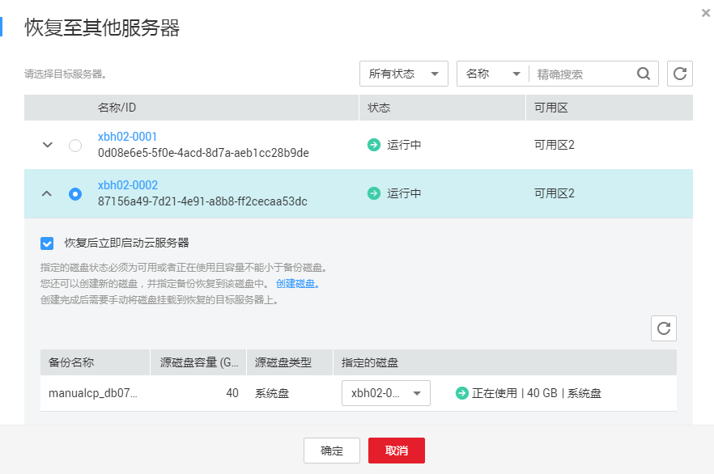

# 使用VMware备份恢复至云上服务器

可以将VMware备份恢复至云上其他的服务器中，实现云上容灾和业务快速部署。

## 背景说明

-   同步至云端的备份无法创建服务器。
-   同步的备份只能用于恢复至其他的云服务器，可以恢复至系统盘和数据盘。
-   执行恢复操作前，请务必按照操作步骤完成安全组的配置，否则可能会导致恢复失败。

## 更改安全组

安全组是一个逻辑上的分组，为同一个虚拟私有云VPC内具有相同安全保护需求并相互信任的弹性云服务器提供访问策略。安全组创建后，用户可以在安全组中定义各种访问规则，当弹性云服务器加入该安全组后，即受到这些访问规则的保护。安全组的默认规则是在出方向上的数据报文全部放行，安全组内的弹性云服务器无需添加规则即可互相访问。系统会为每个云帐号默认创建一个默认安全组，用户也可以创建自定义的安全组。

使用VMware备份恢复前需要先更改安全组。云备份为了您的网络安全考虑，在使用前未设置安全组入方向，需要您手动进行配置。

安全组的出方向需要设置允许100.125.0.0/16网段的1-65535端口，入方向需要设置允许100.125.0.0/16网段的59526-59528端口。出方向规则默认为0.0.0.0/0，即数据报文全部放行。若未修改出方向默认规则，则无需重新设置。

1.  进入云服务器控制台。
2.  单击左侧导航树中的“弹性云服务器”或“裸金属服务器”，在服务器界面选择目标服务器。进入目标服务器详情。
3.  选择“安全组“页签，选择目标安全组，弹性云服务器界面单击列表右侧“更改安全组规则“。裸金属服务器单击“更改安全组“，在弹出框中单击“管理安全组“。
4.  在安全组界面，选择“入方向规则“页签，单击“添加规则“，弹出“添加入方向规则“对话框，如[图1](#fig325675335215)所示。选择“TCP”协议，在“端口“中输入“59526-59528”，在源地址中选择“IP地址“，输入“100.125.0.0/16”。适当补充描述后，单击“确定“，完成入方向规则设置。

    **图 1**  增加入方向规则  
    

5.  选择“出方向规则“页签，单击“添加规则“，弹出“添加出方向规则“对话框，如[图2](#fig12673419116)所示。选择“TCP”协议，在“端口“中输入“1-65535”，在源地址中选择“IP地址“，输入“100.125.0.0/16”。适当补充描述后，单击“确定“，完成出方向规则设置。

    **图 2**  增加出方向规则  
    

## 使用VMware备份恢复数据

1.  登录云备份管理控制台。
    1.  登录管理控制台。
    2.  单击管理控制台左上角的，选择区域和项目。
    3.  单击，选择“存储 \> 云备份 \> 混合云备份 \> VMware备份”。

2.  选择“备份副本“页签，找到存储库和服务器所对应的备份，具体操作参见[查看备份](https://support.huaweicloud.com/usermanual-cbr/cbr_03_0013.html)。
3.  单击备份所在行的“恢复数据”，如[图3](#zh-cn_topic_0160754601_fig65211231152210)所示。

    **图 3**  VMware备份恢复至其他服务器  
    

4.  可选：取消勾选“恢复后立即启动服务器”。

    如果取消勾选“恢复后立即启动服务器”，则恢复服务器操作执行完成后，需要手动启动服务器。

    > **须知：**   
    >恢复服务器的过程中会关闭服务器，请在业务空闲时操作。  

5.  在指定的磁盘下拉菜单中选择备份需要恢复到的磁盘。无法选择系统盘。

    > **说明：**   
    >-   如果服务器只有一个数据盘，则默认恢复到该磁盘。  
    >-   如果服务器只有一个系统盘，则需要创建新的磁盘才可以恢复。  
    >-   如果服务器存在多个磁盘，默认将备份恢复到原来的磁盘。也可以通过在“指定的磁盘“下拉菜单中重新选择磁盘的操作将备份恢复到备份服务器中的其他磁盘中。但是指定的磁盘容量不能小于之前的磁盘容量。  
    >-   备份的数据盘的数据，不能恢复到系统盘中。  

6.  单击“确定”，并确认备份恢复是否成功。

    您可以在备份列表中，查看备份恢复的执行状态。直到备份的“备份状态”恢复为“可用”，并且“任务状态“中没有新增失败的恢复任务时，表示恢复成功。

    查看恢复失败的任务请参见[处理任务](https://support.huaweicloud.com/usermanual-cbr/cbr_03_0035.html)。

