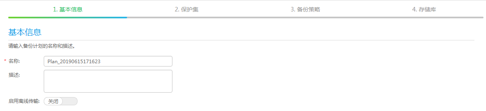

# 创建备份计划

备份计划由存储库、保护集和备份策略组成。创建备份计划后，您可以按照备份计划执行备份任务。

## 前提条件

创建备份计划前，请先创建存储库、保护集和备份策略。

## 背景信息

当用户已经完成备份计划关联任务的配置后，可以通过备份计划向导快速选择已创建的对象，进而启动备份任务。本节重点在于引导用户通过选择已有存储库、保护集和备份策略来完成备份计划的创建。同时，eBackup备份管理系统提供创建备份计划的快捷入口，旨在为初次使用eBackup备份管理系统的用户提供关键配置任务的集合，让用户通过一个向导即可快速完成备份计划的创建。

## 操作步骤

1.  在导航栏上选择“  \> 备份计划”，或者在eBackup备份管理系统中选择“  \>”。
2.  单击“创建”。
3.  在“基本信息”界面输入备份计划的基本信息。

    **图 1**  输入基本信息  
    

    1.  在“名称”中输入备份计划的名称。

        > **说明：** 
        >名称长度范围为1到128位，只能由字母、数字、中文字符、“+”、“\_”、“-”、“.”、“@”组成。

    2.  在“描述”中输入备份计划的描述信息。
    3.  选择是否开启“启用离线传输”。
        -   若开启“启用离线传输”，在选择存储库时，需要选择开启“启用离线传输”存储单元对应的存储库。当Teleport设备或者磁盘断开与VMware环境的连接准备送至华为云数据中心时，或已将Teleport设备或者磁盘送达华为云数据中心且已将数据上传时，需修改备份计划中“启用离线传输”的状态，请参见[后续处理](#zh-cn_topic_0174982996_zh-cn_topic_0170955595_section20294156)。
        -   若未开启启用离线传输”，后期也可在备份计划中开启，请参见[后续处理](#zh-cn_topic_0174982996_zh-cn_topic_0170955595_section20294156)。

    4.  单击“下一步”。

        系统弹出“保护集”界面。

4.  通过以下方式中的任意一种，选择需要的已有保护集。

    -   直接在列表中单击需要的已有保护集。
    -   在列表右上方通过查询方式匹配到需要的保护集后单击该保护集。

    > **说明：** 
    >-   如果没有可供选择的保护集，可以单击界面右上方的“创建保护集”页签创建新的保护集。
    >-   如果选择的保护集中不包含任何虚拟机和虚拟机磁盘，系统将不会对关联的备份计划下发备份任务。

5.  单击“下一步”。

    系统弹出“备份策略”界面。

6.  通过以下方式中的任意一种，选择需要的已有备份策略。

    -   直接在列表中单击需要的已有备份策略。
    -   在列表右上方通过查询方式匹配到需要的备份策略后单击该备份策略。

    > **说明：** 
    >如果没有可供选择的备份策略，可以单击界面右上方的“创建备份策略”页签创建新的备份策略。

7.  **可选: **选择“立即激活”。勾选后，系统将按照所选或新建的备份策略自动执行备份任务。

    > **说明：** 
    >-   系统默认勾选“立即激活”。用户也可以取消勾选，在后续合适的时间再手动启动备份任务或根据备份策略自动进行调度。
    >-   当选择的备份策略设置为“执行一次”时，如果创建备份计划的时间晚于备份策略的执行时间，在备份计划创建完成后（勾选“立即激活”），系统将立即执行备份任务。

8.  单击“下一步”。

    系统弹出“存储库”界面。

9.  通过以下方式中的任意一种，选择已有的存储库作为备份目标。

    -   直接在列表中单击需要的已有存储库。
    -   在列表右上方通过查询方式匹配到需要的存储库后单击该存储库。

    > **说明：** 
    >-   如果[3](#zh-cn_topic_0174982996_zh-cn_topic_0170955595_li59476236)开启“启用离线传输”，需要选择开启“启用离线传输”存储单元对应的存储库。
    >-   如果没有可供选择的存储库，可以单击界面右上方的“创建存储库”页签创建新的存储库。
    >-   如果执行一次备份任务所需要的存储容量超过了存储库的可用容量，且没有超过存储库所属存储池的可用容量，该次备份任务将会执行完成。一旦存储库容量消耗完，将不会再次执行备份任务。

10. 单击“完成”。

    > **须知：** 
    >建议用户不要同一时刻运行多个包含同一个虚拟机的备份计划，可能导致其中某些备份任务失败。

## 后续处理

1.  在导航栏上选择“  \> 备份计划”。
2.  将鼠标悬停在待修改的备份计划上，在右侧操作按钮区单击或单击待修改的备份计划，在右侧信息预览区单击。
3.  请根据实际情况单击“启用离线传输”的状态。

    -   禁用  ：已经将Teleport寄送至华为数据中心，并已将数据上传时，请选择此状态。
    -   开启：用户需要使用离线传输时，请选择此状态。
    -   暂停：已将Teleport或者磁盘从VMware环境中断开连接时，请选择此状态。

    > **说明：** 
    >-   当备份计划中“启用离线传输”为“禁用”时，若备份计划对应任务或相关恢复任务为运行中、终止中、等待调度时，不支持修改为“开启”，请在任务执行完成后修改。
    >-   当备份计划中“启用离线传输”为“禁用”时，不支持修改为“暂停”。
    >-   当备份计划中“启用离线传输”为“开启”时，若备份计划对应任务或相关恢复任务为运行中、终止中、等待调度时，不支持修改为“暂停”，请在任务执行完成后修改。
    >-   当备份计划中“启用离线传输”为“开启”时，不支持修改为“禁用”。
    >-   当备份计划中“启用离线传输”为“暂停”时，不支持修改为“启用”。

4.  单击“确定”。

