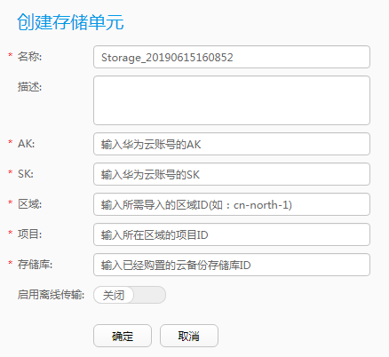

# 创建存储单元

存储单元是在后端存储空间上划分的存储用户备份数据的基础存储单元。后端存储空间映射成功后，必须创建存储单元后才能使用。本节介绍如何将混合云备份存储库接入到eBackup作为存储单元。

## 前提条件

-   eBackup服务器的备份存储网络平面可以正常访问备份存储库的域名（**obs.**_regionid_**.myhuaweicloud.com**）。
-   用户需要提前对混合云备份存储库进行规划。

## 操作步骤

1.  在导航栏上选择“  \> 存储单元”。
2.  单击“创建”。

    **图 1**  创建存储单元  
    

3.  请根据界面提示设置存储单元基本信息。

    > **须知：** 
    >系统管理数据备份存储与保存用户虚拟机数据的备份存储不可使用同一个混合云备份存储库，否则可能会导致备份任务失败。
    >若开启“启用离线传输”请提前将Teleport设备或者磁盘连接到VMware环境中，并且确认eBackup服务器能访问到Teleport设备或者磁盘。

4.  单击“确定”。

    > **说明：** 
    >-   成功创建存储单元之后，系统将自动完成存储空间的挂载操作。
    >-   若开启“启用离线传输”成功创建存储单元之后，系统将会创建一个S3类型和一个NAS类型的存储单元，在创建存储池时，需将这两个存储单元一起添加。
    >-   完成创建存储单元的操作后，存储单元的“可访问状态”显示为“正在检测”（需要一定时间与备份代理建立连接）。稍等片刻系统自动对状态进行刷新，详细信息请参见[管理存储单元](管理存储单元.md#cbr_03_0083)中的“查看存储单元”。

