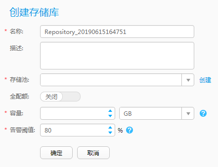

# 创建存储库

存储库是在存储池上划分的一块空间，它为备份提供存储空间、为恢复提供数据源。在备份前，您需要先创建存储库。

## 前提条件

创建存储库之前请先[创建存储池](创建存储池.md#cbr_03_0070)。

## 操作步骤

1.  在导航栏上选择“  \> 存储库”。
2.  单击“创建”。
3.  设置存储库基本信息，相关参数说明如[表1](#zh-cn_topic_0174656200_table896914501476)所示。

    **图 1**  创建存储库  
    

    **表 1**  存储库参数说明

    
    <table><thead align="left"><tr id="zh-cn_topic_0174656200_row896215014714"><th class="cellrowborder" valign="top" width="14.288571142885711%" id="mcps1.2.4.1.1">
参数名称

    </th>
    <th class="cellrowborder" valign="top" width="42.85571442855714%" id="mcps1.2.4.1.2">
参数说明

    </th>
    <th class="cellrowborder" valign="top" width="42.85571442855714%" id="mcps1.2.4.1.3">
设置原则

    </th>
    </tr>
    </thead>
    <tbody><tr id="zh-cn_topic_0174656200_row89638501577"><td class="cellrowborder" valign="top" width="14.288571142885711%" headers="mcps1.2.4.1.1 ">
名称

    </td>
    <td class="cellrowborder" valign="top" width="42.85571442855714%" headers="mcps1.2.4.1.2 ">
用户自定义的存储库名称。

    </td>
    <td class="cellrowborder" valign="top" width="42.85571442855714%" headers="mcps1.2.4.1.3 ">
名称长度范围为1到128位，只能由字母、数字、中文字符、“+”、“_”、“-”、“.”、“@”组成。

    </td>
    </tr>
    <tr id="zh-cn_topic_0174656200_row1096355013711"><td class="cellrowborder" valign="top" width="14.288571142885711%" headers="mcps1.2.4.1.1 ">
描述

    </td>
    <td class="cellrowborder" valign="top" width="42.85571442855714%" headers="mcps1.2.4.1.2 ">
对存储库的描述。

    </td>
    <td class="cellrowborder" valign="top" width="42.85571442855714%" headers="mcps1.2.4.1.3 ">
描述信息不能超过1024个字符。

    </td>
    </tr>
    <tr id="zh-cn_topic_0174656200_row2964165018716"><td class="cellrowborder" valign="top" width="14.288571142885711%" headers="mcps1.2.4.1.1 ">
存储池

    </td>
    <td class="cellrowborder" valign="top" width="42.85571442855714%" headers="mcps1.2.4.1.2 ">
选择已有存储池，在此基础上创建存储库。

    </td>
    <td class="cellrowborder" valign="top" width="42.85571442855714%" headers="mcps1.2.4.1.3 "><ul id="zh-cn_topic_0174656200_ul79635504715"><li>当已规划存储库所属存储池时，请直接选择已规划的存储池。</li><li>当未规划存储库所属存储池并希望利用现有资源时，请根据备份对象中需要备份的数据容量来选择合适的存储池。</li></ul>
    </td>
    </tr>
    <tr id="zh-cn_topic_0174656200_row2096413501876"><td class="cellrowborder" valign="top" width="14.288571142885711%" headers="mcps1.2.4.1.1 ">
全配额

    </td>
    <td class="cellrowborder" valign="top" width="42.85571442855714%" headers="mcps1.2.4.1.2 ">
选择开启或关闭全配额设置。

    </td>
    <td class="cellrowborder" valign="top" width="42.85571442855714%" headers="mcps1.2.4.1.3 "><ul id="zh-cn_topic_0174656200_ul1396419501678"><li>开启：存储库容量为可用容量的最大值。</li><li>关闭：存储库容量由用户指定。</li></ul>
    </td>
    </tr>
    <tr id="zh-cn_topic_0174656200_row119682050773"><td class="cellrowborder" valign="top" width="14.288571142885711%" headers="mcps1.2.4.1.1 ">
容量

    </td>
    <td class="cellrowborder" valign="top" width="42.85571442855714%" headers="mcps1.2.4.1.2 ">
存储库的容量。

    
当关闭“全配额”时，该参数有效。

    </td>
    <td class="cellrowborder" valign="top" width="42.85571442855714%" headers="mcps1.2.4.1.3 ">
存储库的总容量不能超过所选存储池中未分配的存储空间总容量。

    </td>
    </tr>
    <tr id="zh-cn_topic_0174656200_row139688508720"><td class="cellrowborder" valign="top" width="14.288571142885711%" headers="mcps1.2.4.1.1 ">
告警阈值

    </td>
    <td class="cellrowborder" valign="top" width="42.85571442855714%" headers="mcps1.2.4.1.2 ">
当存储库容量利用率超过设定的阈值时，系统将产生相关告警，提示用户及时扩容或删除不需要的备份数据以便释放存储空间。如果不进行相关处理，后续备份任务可能会失败。

    </td>
    <td class="cellrowborder" valign="top" width="42.85571442855714%" headers="mcps1.2.4.1.3 ">
设置合适的容量告警阈值将帮助用户监控存储库容量的使用情况。默认值为80%，建议设置在70%～90%之间。

    </td>
    </tr>
    </tbody>
    </table>

4.  单击“确定”。

