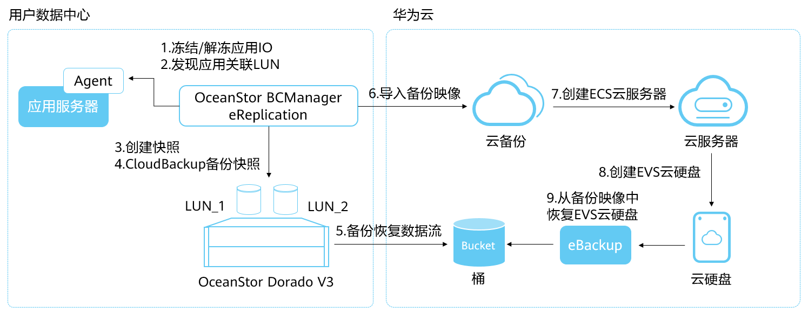
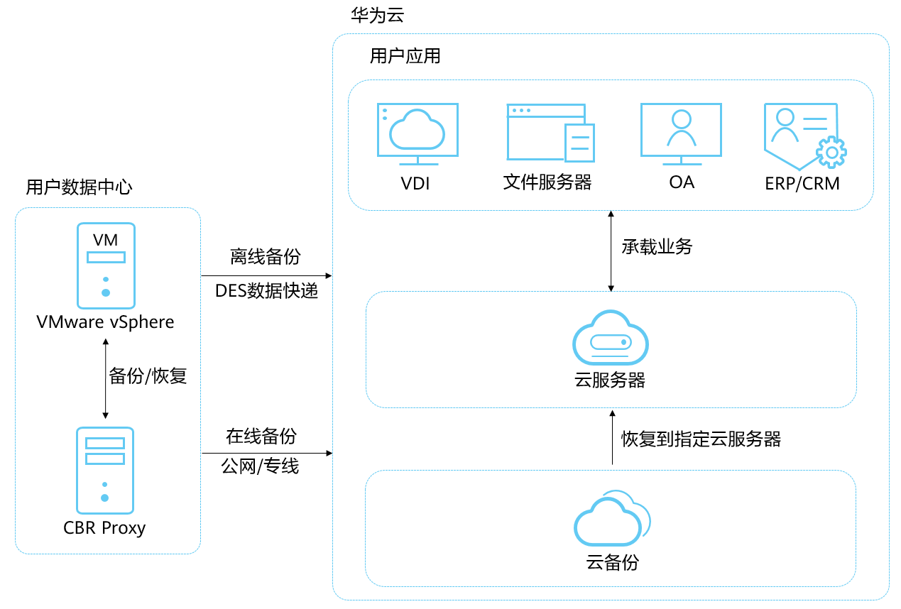

# 场景及适用范围

## 存储备份

OceanStor BCManager eReplication是一款华为技术有限公司开发的容灾业务管理软件套件，eReplication通过良好的应用感知能力，利用底层存储系统所提供的增值特性，在应用服务器侧针对各类常见应用系统提供关键数据保护及容灾恢复解决方案。

结合OceanStor BCManager eReplication和华为云CBR服务实现容灾的过程如[图1](#fig864052310325)所示。

OceanStor BCManager eReplication基于阵列的云备份技术（CloudBackup）可以实现应用一致性备份，结合OceanStor BCManager和云备份服务可以实现阵列备份同步到云上，云上再使用同步备份进行恢复。云上恢复的服务器可以供容灾、业务迁移、开发、测试使用。

**图 1**  存储备份架构图  

## VMware备份

VMware混合云备份，为用户数据中心的VMware虚拟化环境，提供虚拟机整机粒度的备份功能。用户可以选择公有云作为异地灾备站点，将线下的VMware虚拟机备份上公有云，当本地发生人为误操作、软件升级失败、病毒入侵等事件时，可以通过云上的备份数据恢复用户数据中心的VMware虚拟机；当发生数据中心级别的灾难或者光纤网络故障等事件时，可以在公有云上通过备份数据快速创建云服务器，缩短业务中断时间。

VMware备份架构图如[图2](#fig5636259205317)所示。

**图 2**  VMware备份架构图  

支持恢复至云上服务器的VMware版本包括VMware vSphere 5.1、VMware vSphere 5.5、VMware vSphere 6.0、VMware vSphere 6.5、VMware vSphere 6.7。如果仅作为云下备份，则无VMware版本限制。

支持的操作系统列表如[表1](#table31233581051)所示。

**表 1**  支持的操作系统

<table><thead align="left"><tr id="row131231258456"><th class="cellrowborder" valign="top" width="50%" id="mcps1.2.3.1.1">
操作系统类型

</th>
<th class="cellrowborder" valign="top" width="50%" id="mcps1.2.3.1.2">
版本范围

</th>
</tr>
</thead>
<tbody><tr id="row61241558253"><td class="cellrowborder" valign="top" width="50%" headers="mcps1.2.3.1.1 ">
Windows

</td>
<td class="cellrowborder" valign="top" width="50%" headers="mcps1.2.3.1.2 ">
Windows 7

Windows Server 2008 R2

Windows Server 2012

Windows Server 2012 R2

Windows Server 2016

Windows Server 2019

</td>
</tr>
<tr id="row191243581758"><td class="cellrowborder" valign="top" width="50%" headers="mcps1.2.3.1.1 ">
CentOS

</td>
<td class="cellrowborder" valign="top" width="50%" headers="mcps1.2.3.1.2 ">
CentOS 6.4

CentOS 6.5

CentOS 7.2

CentOS 7.3

CentOS 7.4

CentOS 7.5

CentOS 7.6

CentOS 7.7

</td>
</tr>
<tr id="row3124358159"><td class="cellrowborder" valign="top" width="50%" headers="mcps1.2.3.1.1 ">
RedHat

</td>
<td class="cellrowborder" valign="top" width="50%" headers="mcps1.2.3.1.2 ">
RedHat 6.4

RedHat 6.5

RedHat 7.2

</td>
</tr>
</tbody>
</table>

