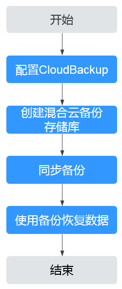

# 存储备份操作流程

存储备份备份操作流程如[图1](#fig2797188183412)所示。

**图 1**  存储备份备份操作流程  

1.  配置CloudBackup：此操作需要您在OceanStor Dorado阵列中完成，请查阅[《OceanStor Dorado V3系列 V300R002 CloudBackup特性指南》](https://support.huawei.com/carrier/docview?nid=DOC1100469343)。
2.  创建混合云备份存储库：您需要在云上创建混合云备份存储库，用于存放存储备份。相关操作请参见[购买混合云备份存储库](购买混合云备份存储库.md)。
3.  同步备份：如果线下使用离线备份，则需要通过同步备份，将备份同步至云上存储库中以备后续操作。
4.  使用备份恢复数据：使用同步成功的备份，恢复至云上服务器中，以供容灾、业务迁移、开发、测试使用。

