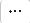

# 管理证书

eBackup支持统一的证书管理功能，包括导入、查看和删除证书。

## 获取证书

请优先向相应产品的运维管理人员获取相应的证书文件。如果未获取，请参考以下操作需求获取相应的证书。如果获取不到，请联系技术支持工程师。

VMware的CA证书

使用浏览器登入VMware vCenter环境，单击“下载受信任的根CA证书“，下载证书压缩包至本地任意目录。

下载后，证书压缩包文件类型修改为“.zip“格式，修改完成后，打开证书压缩文件，查找“\*.0“格式文件，并修改其文件类型为“\*.crt“格式。

导入证书操作过程中，VMware的证书类型请选择“受保护环境“。

## 导入证书

1.  在导航栏上选择“  \>  证书“。
2.  单击“导入“。

    当eBackup和对接的设备使用“HTTPS“协议通信时，建议导入有效的CA证书，否则eBackup将无法验证对接设备的信息，安全性存在风险。

3.  选择需要导入的证书类型。
    -   受保护环境：当eBackup与受保护环境的通信协议为“HTTPS“时，有效的证书能让备份管理系统验证受保护环境信息。请向受保护环境的管理员获取证书。

        当添加存储设备、vCenter和VRM受保护环境时，请导入存储设备新的CA证书。

    -   S3存储：当创建S3类型的存储单元且选择eBackup与存储单元间的通信协议为“HTTPS“、使用S3类型的存储作为管理数据的备份存储时，有效的证书能让备份管理系统验证存储单元信息。请向存储设备的管理员获取证书。
    -   邮件服务器：当需要开启邮件通知的SSL安全协议时，需要导入SMTP服务器的CA证书，以供eBackup验证邮件服务器。请向SMTP服务器的管理员获取证书。
    -   FTP服务器：当Manager与FTP服务器的通信协议为“FTPS“时，有效的证书能让Manager验证FTP服务器。请向FTP服务器的管理员获取证书。

4.  单击，选择需要导入的证书，单击“上传“。
5.  单击“确定“。

## 查看证书

1.  在导航栏上选择“  \>  证书“。
2.  可在本页面查看已导入的证书的详细信息，如[表1](#zh-cn_topic_0000001213523996_zh-cn_topic_0170955537_manage_certificate_tab01)所示。

    **表 1**  证书详细信息说明

    
    <table><thead align="left"><tr id="zh-cn_topic_0000001213523996_zh-cn_topic_0170955537_row82631488"><th class="cellrowborder" valign="top" width="33.5%" id="mcps1.2.3.1.1">
参数

    </th>
    <th class="cellrowborder" valign="top" width="66.5%" id="mcps1.2.3.1.2">
说明

    </th>
    </tr>
    </thead>
    <tbody><tr id="zh-cn_topic_0000001213523996_zh-cn_topic_0170955537_row16283144811"><td class="cellrowborder" valign="top" width="33.5%" headers="mcps1.2.3.1.1 ">
指纹

    </td>
    <td class="cellrowborder" valign="top" width="66.5%" headers="mcps1.2.3.1.2 ">
证书的识别标识。

    </td>
    </tr>
    <tr id="zh-cn_topic_0000001213523996_zh-cn_topic_0170955537_row182163144818"><td class="cellrowborder" valign="top" width="33.5%" headers="mcps1.2.3.1.1 ">
颁发给

    </td>
    <td class="cellrowborder" valign="top" width="66.5%" headers="mcps1.2.3.1.2 ">
证书颁发给的对象的标识。

    </td>
    </tr>
    <tr id="zh-cn_topic_0000001213523996_zh-cn_topic_0170955537_row3293194810"><td class="cellrowborder" valign="top" width="33.5%" headers="mcps1.2.3.1.1 ">
颁发者

    </td>
    <td class="cellrowborder" valign="top" width="66.5%" headers="mcps1.2.3.1.2 ">
证书颁发的机构的标识。

    </td>
    </tr>
    <tr id="zh-cn_topic_0000001213523996_zh-cn_topic_0170955537_row62133164820"><td class="cellrowborder" valign="top" width="33.5%" headers="mcps1.2.3.1.1 ">
类型

    </td>
    <td class="cellrowborder" valign="top" width="66.5%" headers="mcps1.2.3.1.2 ">
导入证书的类型，分为“受保护环境”、“S3存储”和“邮件”。

    </td>
    </tr>
    <tr id="zh-cn_topic_0000001213523996_row164213563516"><td class="cellrowborder" valign="top" width="33.5%" headers="mcps1.2.3.1.1 ">
描述

    </td>
    <td class="cellrowborder" valign="top" width="66.5%" headers="mcps1.2.3.1.2 ">
证书的描述。

    </td>
    </tr>
    <tr id="zh-cn_topic_0000001213523996_zh-cn_topic_0170955537_row04173194817"><td class="cellrowborder" valign="top" width="33.5%" headers="mcps1.2.3.1.1 ">
创建时间

    </td>
    <td class="cellrowborder" valign="top" width="66.5%" headers="mcps1.2.3.1.2 ">
证书申请的时间。

    </td>
    </tr>
    <tr id="zh-cn_topic_0000001213523996_zh-cn_topic_0170955537_row54133104810"><td class="cellrowborder" valign="top" width="33.5%" headers="mcps1.2.3.1.1 ">
证书过期时间

    </td>
    <td class="cellrowborder" valign="top" width="66.5%" headers="mcps1.2.3.1.2 ">
证书过期的时间。在颁发证书时确认。

    </td>
    </tr>
    </tbody>
    </table>

## 删除证书

需要删除无用的或过期的证书。

1.  在导航栏上选择“  \>  证书“。
2.  选择待删除的证书，在证书信息行的末端单击。
3.  仔细阅读提示信息后，单击“确定“。

