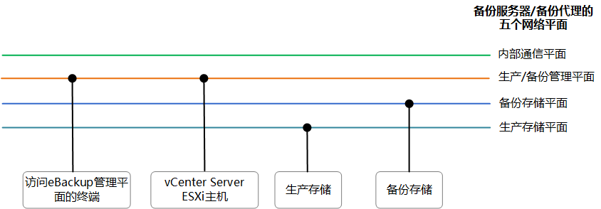

# 规划网络

在安装和配置eBackup备份软件前，您需要了解软件对网络连接的要求及建议，以便能够顺利的完成网络规划。

## 典型组网建议

默认情况下eBackup有五个网络平面，您需要为每个网络平面规划IP地址，以保证eBackup与周边其他组件正常通信。网络平面的详细说明如[网络平面介绍](#zh-cn_topic_0217968445_section15264135783215)所示。本节介绍VMware备份上云中eBackup的典型组网建议。

-   为eBackup规划2个IP地址：内网IP地址和公网IP地址

    该场景下请确保内网IP地址与访问eBackup管理平面的终端、vCenter Server/ESXi主机以及生产存储网络连通；确保公网IP地址与备份存储网络连通。

    此时需要为eBackup配置2张网卡，一张配置为内网IP地址，一张配置为公网IP地址。

    eBackup的生产管理平面、备份管理平面、内部通信平面、生产存储平面四平面合一，均绑定在内网IP地址的网卡上；eBackup的备份存储平面绑定在公网IP地址的网卡上。

    eBackup网络平面IP地址及周边组件的IP地址配置示例如[表1](#zh-cn_topic_0217968445_d0e4780)所示。

-   为eBackup规划1个IP地址

    该场景下请确保该IP地址与访问eBackup管理平面的终端、vCenter Server/ESXi主机、生产存储以及备份存储网络连通。

    此时需要为eBackup配置1张网卡，配置为内网IP地址。

    eBackup的所有网络平面合一，eBackup的生产管理平面、备份管理平面、内部通信平面、生产存储平面、备份存储平面均绑定在同一张网卡上。

    eBackup网络平面IP地址及周边组件的IP地址配置示例如[表1](#zh-cn_topic_0217968445_d0e4780)所示。

## 网络平面介绍

eBackup网络平面如[图1](#zh-cn_topic_0217968445_fig9948824125418)所示。

**图 1**  eBackup网络平面  

**表 1**  eBackup网络平面说明

<table><thead align="left"><tr id="zh-cn_topic_0217968445_row13863646"><th class="cellrowborder" valign="top" width="20.32%" id="mcps1.2.5.1.1">
信息项

</th>
<th class="cellrowborder" valign="top" width="37.82%" id="mcps1.2.5.1.2">
说明

</th>
<th class="cellrowborder" valign="top" width="20.820000000000004%" id="mcps1.2.5.1.3">
IP地址配置示例（规划2个IP地址）

</th>
<th class="cellrowborder" valign="top" width="21.040000000000003%" id="mcps1.2.5.1.4">
IP地址配置示例（规划1个IP地址）

</th>
</tr>
</thead>
<tbody><tr id="zh-cn_topic_0217968445_row29516270"><td class="cellrowborder" valign="top" width="20.32%" headers="mcps1.2.5.1.1 ">
访问eBackup管理平面的终端

</td>
<td class="cellrowborder" valign="top" width="37.82%" headers="mcps1.2.5.1.2 ">
该终端通过eBackup管理平面IP地址访问eBackup备份管理系统，从而进行备份恢复业务的配置和管理。

</td>
<td class="cellrowborder" valign="top" width="20.820000000000004%" headers="mcps1.2.5.1.3 ">
192.168.1.11

</td>
<td class="cellrowborder" valign="top" width="21.040000000000003%" headers="mcps1.2.5.1.4 ">
192.168.1.11

</td>
</tr>
<tr id="zh-cn_topic_0217968445_row66289362298"><td class="cellrowborder" valign="top" width="20.32%" headers="mcps1.2.5.1.1 ">
vCenter Server/ESXi主机

</td>
<td class="cellrowborder" valign="top" width="37.82%" headers="mcps1.2.5.1.2 ">
统一管理VMware虚拟机的vCenter Server或ESXi主机。

</td>
<td class="cellrowborder" valign="top" width="20.820000000000004%" headers="mcps1.2.5.1.3 ">
192.168.1.15

</td>
<td class="cellrowborder" valign="top" width="21.040000000000003%" headers="mcps1.2.5.1.4 ">
192.168.1.15

</td>
</tr>
<tr id="zh-cn_topic_0217968445_row63389730"><td class="cellrowborder" valign="top" width="20.32%" headers="mcps1.2.5.1.1 ">
生产存储

</td>
<td class="cellrowborder" valign="top" width="37.82%" headers="mcps1.2.5.1.2 ">
接入VMware虚拟化环境的生产存储。

</td>
<td class="cellrowborder" valign="top" width="20.820000000000004%" headers="mcps1.2.5.1.3 ">
192.168.1.16

</td>
<td class="cellrowborder" valign="top" width="21.040000000000003%" headers="mcps1.2.5.1.4 ">
192.168.1.16

</td>
</tr>
<tr id="zh-cn_topic_0217968445_row38435363"><td class="cellrowborder" valign="top" width="20.32%" headers="mcps1.2.5.1.1 ">
备份存储

</td>
<td class="cellrowborder" valign="top" width="37.82%" headers="mcps1.2.5.1.2 ">
保存备份数据的存储，即已购买的Vault。

</td>
<td class="cellrowborder" valign="top" width="20.820000000000004%" headers="mcps1.2.5.1.3 ">
10.10.1.15

</td>
<td class="cellrowborder" valign="top" width="21.040000000000003%" headers="mcps1.2.5.1.4 ">
192.168.1.18

</td>
</tr>
<tr id="zh-cn_topic_0217968445_row21079618"><td class="cellrowborder" valign="top" width="20.32%" headers="mcps1.2.5.1.1 ">
管理平面

</td>
<td class="cellrowborder" valign="top" width="37.82%" headers="mcps1.2.5.1.2 "><ul id="zh-cn_topic_0217968445_ul15349132591111"><li>生产管理平面
备份服务器以及备份代理和vCenter Server/ESXi主机之间的网络平面。

</li><li>备份管理平面
备份服务器以及备份代理和访问eBackup管理平面的终端之间的网络平面。

</li></ul>
</td>
<td class="cellrowborder" valign="top" width="20.820000000000004%" headers="mcps1.2.5.1.3 ">
192.168.1.10

</td>
<td class="cellrowborder" valign="top" width="21.040000000000003%" headers="mcps1.2.5.1.4 ">
192.168.1.10

</td>
</tr>
<tr id="zh-cn_topic_0217968445_row23494191"><td class="cellrowborder" valign="top" width="20.32%" headers="mcps1.2.5.1.1 ">
内部通信平面

</td>
<td class="cellrowborder" valign="top" width="37.82%" headers="mcps1.2.5.1.2 ">
备份服务器和备份代理之间的网络平面。

</td>
<td class="cellrowborder" valign="top" width="20.820000000000004%" headers="mcps1.2.5.1.3 ">
192.168.1.10

</td>
<td class="cellrowborder" valign="top" width="21.040000000000003%" headers="mcps1.2.5.1.4 ">
192.168.1.10

</td>
</tr>
<tr id="zh-cn_topic_0217968445_row11047249"><td class="cellrowborder" valign="top" width="20.32%" headers="mcps1.2.5.1.1 ">
生产存储平面

</td>
<td class="cellrowborder" valign="top" width="37.82%" headers="mcps1.2.5.1.2 ">
备份服务器以及备份代理和生产存储之间的网络平面。

</td>
<td class="cellrowborder" valign="top" width="20.820000000000004%" headers="mcps1.2.5.1.3 ">
192.168.1.10

</td>
<td class="cellrowborder" valign="top" width="21.040000000000003%" headers="mcps1.2.5.1.4 ">
192.168.1.10

</td>
</tr>
<tr id="zh-cn_topic_0217968445_row1177912208498"><td class="cellrowborder" valign="top" width="20.32%" headers="mcps1.2.5.1.1 ">
备份存储平面

</td>
<td class="cellrowborder" valign="top" width="37.82%" headers="mcps1.2.5.1.2 ">
备份服务器以及备份代理和备份存储之间的网络平面。

</td>
<td class="cellrowborder" valign="top" width="20.820000000000004%" headers="mcps1.2.5.1.3 ">
10.10.1.10

</td>
<td class="cellrowborder" valign="top" width="21.040000000000003%" headers="mcps1.2.5.1.4 ">
192.168.1.10

</td>
</tr>
</tbody>
</table>

