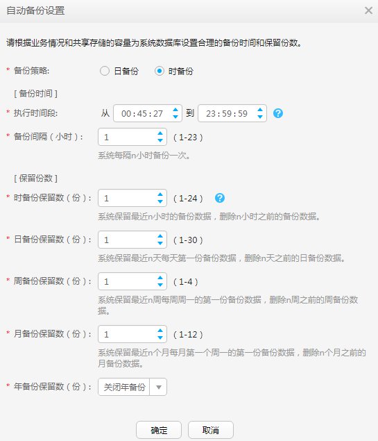

# 配置管理数据备份存储

配置保存eBackup管理数据（数据库及配置文件等）的备份存储信息，用于发生灾难后恢复eBackup管理系统。eBackup支持NFS、S3、FTP和SFTP存储作为管理数据的备份存储。本节介绍如何配置S3类型的备份存储。

## 背景信息

-   备份eBackup管理数据时应预先计算共享存储的容量，当共享存储容量不足时最新的备份任务将会失败，共享存储的容量与设置的备份数据保留策略有关：
    -   当选择“日备份”时

        管理数据备份共享存储容量=\[\(年备个数+月备个数+周备个数+日备个数+1\)×10 + 15\]GB。

        -   例如，当取系统默认值时，管理数据备份共享存储容量=\[\(0+1+1+1+1\)×10 + 15\]GB=55GB。
        -   当“年备份”设置为“永久保留”时，规划的容量跟计划保留的年数有关。管理数据备份共享存储容量=\[\(计划保留的年数+月备个数+周备个数+日备个数+1\)×10 + 15\]GB。

    -   当选择“时备份”时

        管理数据备份共享存储容量=\[\(年备个数+月备个数+周备个数+日备个数+时备个数+1\)×10 + 15\]GB。

        -   例如，当取系统默认值时，管理数据备份共享存储容量=\[\(0+1+1+1+1+1\)×10 + 15\]GB=65GB。
        -   当“年备份”设置为“永久保留”时，规划的容量跟计划保留的年数有关。管理数据备份共享存储容量=\[\(计划保留的年数+月备个数+周备个数+日备个数+时备个数+1\)×10 + 15\]GB。

-   请为eBackup管理数据配置单独的备份存储空间。
-   S3类型的备份存储推荐使用购买的混合云备份存储库。

## 前提条件

-   已规划S3共享存储的容量，共享存储的容量应符合要求，否则会导致备份任务失败，可参考[背景信息](#zh-cn_topic_0000001213523994_d0e3317)进行规划。
-   已获取S3存储的业务平面域名或者IP地址、保存备份数据的桶名称、AK、SK。

## 操作步骤

1.  以“admin”帐号登录eBackup备份管理系统。

    详细信息请参见[登录eBackup](登录eBackup.md#cbr_03_0092)。

2.  在导航栏上选择“  \> 配置 \> 管理数据备份”。
3.  单击“设置备份存储”。
4.  配置保存eBackup管理数据的备份存储信息。

    相关参数说明如[表1](#zh-cn_topic_0000001213523994_tbd3bda55f26d407489aeab8844515a67)所示。

    > **须知：** 
    >管理数据备份存储与保存用户虚拟机数据的备份存储不可使用同一个桶，否则可能导致备份任务失败。

    **表 1**  备份存储参数说明（S3）

    
    <table><thead align="left"><tr id="zh-cn_topic_0000001213523994_r3cffad3996514279b0371f3d167c7b40"><th class="cellrowborder" valign="top" width="22.45%" id="mcps1.2.4.1.1">
参数名称

    </th>
    <th class="cellrowborder" valign="top" width="33.629999999999995%" id="mcps1.2.4.1.2">
参数说明

    </th>
    <th class="cellrowborder" valign="top" width="43.919999999999995%" id="mcps1.2.4.1.3">
设置原则

    </th>
    </tr>
    </thead>
    <tbody><tr id="zh-cn_topic_0000001213523994_r6304f6ef4c274d98a7ec31a237fda239"><td class="cellrowborder" valign="top" width="22.45%" headers="mcps1.2.4.1.1 ">
类型

    </td>
    <td class="cellrowborder" valign="top" width="33.629999999999995%" headers="mcps1.2.4.1.2 ">
管理数据备份存储的类型。

    </td>
    <td class="cellrowborder" valign="top" width="43.919999999999995%" headers="mcps1.2.4.1.3 ">
S3

    </td>
    </tr>
    <tr id="zh-cn_topic_0000001213523994_r89e5d31333d4499db9dd9bfd20775869"><td class="cellrowborder" valign="top" width="22.45%" headers="mcps1.2.4.1.1 ">
协议

    </td>
    <td class="cellrowborder" valign="top" width="33.629999999999995%" headers="mcps1.2.4.1.2 ">
eBackup备份管理系统与S3存储通信的网络协议。可选项包括“HTTP”和“HTTPS”。

    </td>
    <td class="cellrowborder" valign="top" width="43.919999999999995%" headers="mcps1.2.4.1.3 "><ul id="zh-cn_topic_0000001213523994_ul185993171952"><li>当使用“HTTPS”协议时，请导入有效的证书以便备份管理系统验证S3存储的信息。请提前向S3存储的管理员获取证书。</li><li>当协议设置为HTTP时，将存在安全风险。建议您选择安全性高的HTTPS协议。</li></ul>
    </td>
    </tr>
    <tr id="zh-cn_topic_0000001213523994_r0bde74897fb94f1c8960e80d36cb750d"><td class="cellrowborder" valign="top" width="22.45%" headers="mcps1.2.4.1.1 ">
AK

    </td>
    <td class="cellrowborder" valign="top" width="33.629999999999995%" headers="mcps1.2.4.1.2 ">
AK（Access Key）为用户在对象存储服务系统中的接入键标识，用于识别访问系统的用户。

    </td>
    <td class="cellrowborder" valign="top" width="43.919999999999995%" headers="mcps1.2.4.1.3 ">
-

    </td>
    </tr>
    <tr id="zh-cn_topic_0000001213523994_rfc2eb000e8ef4aeaa03903051ebc90f4"><td class="cellrowborder" valign="top" width="22.45%" headers="mcps1.2.4.1.1 ">
SK

    </td>
    <td class="cellrowborder" valign="top" width="33.629999999999995%" headers="mcps1.2.4.1.2 ">
SK（Secret Key）为用户在对象存储服务系统中的安全接入键，是用户访问对象存储服务系统的密钥。安全接入键和接入键标识一一对应。

    </td>
    <td class="cellrowborder" valign="top" width="43.919999999999995%" headers="mcps1.2.4.1.3 ">
-

    </td>
    </tr>
    <tr id="zh-cn_topic_0000001213523994_r8a2ff510c11b48bb9d1862b9f464a6f5"><td class="cellrowborder" valign="top" width="22.45%" headers="mcps1.2.4.1.1 ">
路径

    </td>
    <td class="cellrowborder" valign="top" width="33.629999999999995%" headers="mcps1.2.4.1.2 ">
访问S3存储的路径。

    </td>
    <td class="cellrowborder" valign="top" width="43.919999999999995%" headers="mcps1.2.4.1.3 ">
IPV4的路径格式：IP或域名:/桶名

    
其中，“IP”和“域名”分别为对象存储服务系统的服务IP地址和域名。桶名长度范围是3到255位，由字母、数字和特殊字符组成，特殊字符包括.-_ 。

    </td>
    </tr>
    <tr id="zh-cn_topic_0000001213523994_rdb27d70e96a941c6917cd7c95f3620ee"><td class="cellrowborder" valign="top" width="22.45%" headers="mcps1.2.4.1.1 ">
标识符

    </td>
    <td class="cellrowborder" valign="top" width="33.629999999999995%" headers="mcps1.2.4.1.2 ">
存放管理数据备份数据的子文件夹名称，用于区分不同eBackup系统管理数据的备份数据。

    </td>
    <td class="cellrowborder" valign="top" width="43.919999999999995%" headers="mcps1.2.4.1.3 ">
长度范围是1到64位，只能由字母、数字、“_”和“-”组成。

    </td>
    </tr>
    <tr id="zh-cn_topic_0000001213523994_ra98556ed6ac143e886e978b64b8b78ae"><td class="cellrowborder" valign="top" width="22.45%" headers="mcps1.2.4.1.1 ">
系统存在同名子文件夹时，仍强制使用该文件夹。

    </td>
    <td class="cellrowborder" valign="top" width="33.629999999999995%" headers="mcps1.2.4.1.2 ">
存在同名子文件夹时，是否追加写入。<ul id="zh-cn_topic_0000001213523994_uc9a7a0aaf9ed4af1bd5a9f6d48b7cd78"><li>勾选
如果存在同名子文件夹，则会在已存在的同名子文件夹追加写入eBackup的备份数据。

    
 说明： 

如果多套eBackup使用同一个备份子文件夹，则会导致管理数据备份不可用，建议多套eBackup的场景下，各自命名不同的子文件夹名称。

    

    </li><li>不勾选
如果存在同名子文件夹，则配置管理数据备份存储失败。此时请修改子文件夹名称，使其不重名。

    </li></ul>
    

    </td>
    <td class="cellrowborder" valign="top" width="43.919999999999995%" headers="mcps1.2.4.1.3 ">
-

    </td>
    </tr>
    </tbody>
    </table>

5.  单击“确定”，完成备份存储的配置。

    完成配置后，“设置备份存储”的按钮右侧会显示备份存储的配置状态。

    -   ：正在配置中
    -   无图标：成功
    -   ：失败

    > **说明：** 
    >失败后，请单击“设置备份存储”，根据提示信息重新配置。

6.  **可选: **配置系统管理数据的备份策略。

    > **说明：** 
    >为确保备份软件系统数据库的安全，建议您定期对其进行备份。系统每次执行全量备份。

    -   单击“自动备份设置”，在弹出的对话框中根据提示信息配置自动备份的策略。

        -   当选择“日备份”时，系统默认设置如下图所示。

            **图 1**  设置日备份  
            

        -   当选择“时备份”时，系统默认设置如下图所示。

            **图 2**  设置时备份  
            

        -   时备份：系统每间隔n小时产生的备份为时备份。
        -   日备份：每天第一份备份数据为日备份。
        -   周备份：每周周一的第一份备份数据为周备份。
        -   月备份：每月第一个周一的第一份备份数据为月备份。
        -   年备份：每年第一个周一的第一份备份数据为年备份。

        > **说明：** 
        >建议您将备份时间设置在业务量少的时间，以减少对正常业务的影响。如每天凌晨00:00-02:00时间段执行备份。
        >完成自动备份策略的配置后，需要在备份服务器上重新启动eBackup进程，才能使之生效。具体操作请参见重新启动eBackup进程。
        >当备份时间重叠时（比如月备份和周备份都在周一发生），系统按照最高优先级定义备份数据。优先级为年备份\>月备份\>周备份\>日备份\>时备份。

    -   单击“手动立即备份”，立即执行备份任务。

        > **说明：** 
        >建议您在重大操作（如升级、重大数据调整等）前及操作后对系统数据库进行手动立即备份。

## 后续处理

当需要删除不必要的备份数据时，可根据备份后的管理数据的压缩包命名规则来找到对应的数据并对其进行处理。系统管理数据的备份数据的文件名为“\[备份数据类型\]\[备份执行方式\]\[服务名\]\[年\]\[月\]\[日\]\[分\]\[秒\]\[备份周期\]\[序号\].db”。下面将以“FMTEBACKUP20170811110307X001.db”为例，进行说明。

**表 2**  参数说明

<table><thead align="left"><tr id="zh-cn_topic_0000001213523994_row23530993"><th class="cellrowborder" valign="top" width="23.23%" id="mcps1.2.4.1.1">
参数

</th>
<th class="cellrowborder" valign="top" width="25.25%" id="mcps1.2.4.1.2">
说明

</th>
<th class="cellrowborder" valign="top" width="51.519999999999996%" id="mcps1.2.4.1.3">
规则

</th>
</tr>
</thead>
<tbody><tr id="zh-cn_topic_0000001213523994_row62536018"><td class="cellrowborder" valign="top" width="23.23%" headers="mcps1.2.4.1.1 ">
F

</td>
<td class="cellrowborder" valign="top" width="25.25%" headers="mcps1.2.4.1.2 ">
备份数据类型

</td>
<td class="cellrowborder" valign="top" width="51.519999999999996%" headers="mcps1.2.4.1.3 ">
此处可显示值：

<ul id="zh-cn_topic_0000001213523994_ul7226346"><li>F：全量备份</li><li>I：增量备份</li></ul>
</td>
</tr>
<tr id="zh-cn_topic_0000001213523994_row33514934"><td class="cellrowborder" valign="top" width="23.23%" headers="mcps1.2.4.1.1 ">
MT

</td>
<td class="cellrowborder" valign="top" width="25.25%" headers="mcps1.2.4.1.2 ">
备份执行方式

</td>
<td class="cellrowborder" valign="top" width="51.519999999999996%" headers="mcps1.2.4.1.3 ">
此处可显示值：

<ul id="zh-cn_topic_0000001213523994_ul29922057"><li>MT：手动备份</li><li>AT：自动备份</li></ul>
</td>
</tr>
<tr id="zh-cn_topic_0000001213523994_row2799415"><td class="cellrowborder" valign="top" width="23.23%" headers="mcps1.2.4.1.1 ">
EBACKUP

</td>
<td class="cellrowborder" valign="top" width="25.25%" headers="mcps1.2.4.1.2 ">
服务名

</td>
<td class="cellrowborder" valign="top" width="51.519999999999996%" headers="mcps1.2.4.1.3 ">
固定为EBACKUP

</td>
</tr>
<tr id="zh-cn_topic_0000001213523994_row22109730"><td class="cellrowborder" valign="top" width="23.23%" headers="mcps1.2.4.1.1 ">
20170811110307

</td>
<td class="cellrowborder" valign="top" width="25.25%" headers="mcps1.2.4.1.2 ">
备份执行的具体时间

</td>
<td class="cellrowborder" valign="top" width="51.519999999999996%" headers="mcps1.2.4.1.3 ">
xxxx年xx月xx日xx时xx分xx秒

</td>
</tr>
<tr id="zh-cn_topic_0000001213523994_row6203318"><td class="cellrowborder" valign="top" width="23.23%" headers="mcps1.2.4.1.1 ">
X

</td>
<td class="cellrowborder" valign="top" width="25.25%" headers="mcps1.2.4.1.2 ">
备份周期

</td>
<td class="cellrowborder" valign="top" width="51.519999999999996%" headers="mcps1.2.4.1.3 ">
此处可显示值：

<ul id="zh-cn_topic_0000001213523994_ul41657754"><li>D：日备份</li><li>W：周备份</li><li>M：月备份</li><li>Y：年备份</li><li>X：手动立即执行备份（手动备份的数据不会自动删除）</li></ul>

 说明： 

当备份时间重叠时（比如月备份和周备份都在周一发生），系统按照最高优先级定义备份数据。优先级为年备份&gt;月备份&gt;周备份&gt;日备份&gt;时备份。

</td>
</tr>
<tr id="zh-cn_topic_0000001213523994_row35377840"><td class="cellrowborder" valign="top" width="23.23%" headers="mcps1.2.4.1.1 ">
001

</td>
<td class="cellrowborder" valign="top" width="25.25%" headers="mcps1.2.4.1.2 ">
备份数据序号

</td>
<td class="cellrowborder" valign="top" width="51.519999999999996%" headers="mcps1.2.4.1.3 ">
-

</td>
</tr>
</tbody>
</table>

