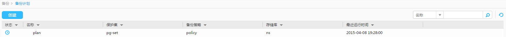

# （可选）手动执行备份

针对已创建的备份计划，您可以选择按照备份策略自动执行备份，也可以选择手动立即执行备份。

## 前提条件

请确保存储库的可用存储容量满足备份计划执行备份所需要的存储容量。

## 背景信息

执行备份任务分为以下两种方式。

-   自动执行：

    备份任务将按照备份策略自动执行，无须手动干涉。

-   手动执行：

    手动执行是由用户自行启动的，且基于备份策略执行备份任务。

手动执行备份任务时，eBackup备份管理系统支持的备份类型包括全量备份和增量备份。用户可以根据实际需求及存储资源条件选择相应的备份类型，相关说明如[表1](#zh-cn_topic_0000001213204036_zh-cn_topic_0170955559_about_policy_tab01)所示。

**表 1**  手动执行备份任务时的备份类型说明

<table><thead align="left"><tr id="zh-cn_topic_0000001213204036_zh-cn_topic_0170955559_row16628080"><th class="cellrowborder" valign="top" width="15.151515151515152%" id="mcps1.2.4.1.1">
备份类型

</th>
<th class="cellrowborder" valign="top" width="42.42424242424242%" id="mcps1.2.4.1.2">
说明

</th>
<th class="cellrowborder" valign="top" width="42.42424242424242%" id="mcps1.2.4.1.3">
设置建议

</th>
</tr>
</thead>
<tbody><tr id="zh-cn_topic_0000001213204036_zh-cn_topic_0170955559_row52477588"><td class="cellrowborder" valign="top" width="15.151515151515152%" headers="mcps1.2.4.1.1 ">
全量备份

</td>
<td class="cellrowborder" valign="top" width="42.42424242424242%" headers="mcps1.2.4.1.2 ">
将备份对象的所有数据进行备份。不论数据上次是何时修改或备份的，都将对数据进行备份。按照备份策略进行调度时，系统默认第一次执行全量备份，用户也可以根据业务实际需求，手动触发全量备份。全量备份提供最全的备份保护，但备份的时间较长，且占用较大的空间。

</td>
<td class="cellrowborder" valign="top" width="42.42424242424242%" headers="mcps1.2.4.1.3 ">
如果对数据保护级别要求高，对备份和还原时间没有要求且存储资源充足，可以只采用全量备份的方式。

手动触发备份任务时，如果系统未执行过任何备份任务，则只能选择全量备份。如果系统之前已执行过备份任务，则可以选择全量备份或增量备份。

</td>
</tr>
<tr id="zh-cn_topic_0000001213204036_zh-cn_topic_0170955559_row44038143"><td class="cellrowborder" valign="top" width="15.151515151515152%" headers="mcps1.2.4.1.1 ">
增量备份

</td>
<td class="cellrowborder" valign="top" width="42.42424242424242%" headers="mcps1.2.4.1.2 ">
增量备份是对所有自上次全量备份或者增量备份操作以来所修改过的数据进行备份，每次备份的数据都较少，备份时间较短。

按照备份策略进行调度时，系统默认第一次执行全量备份。备份过程中，如果系统检测到前一次备份副本不可用时，将执行全量备份，其他时候均执行增量备份。

</td>
<td class="cellrowborder" valign="top" width="42.42424242424242%" headers="mcps1.2.4.1.3 ">
如果对备份时间要求高，且存储资源充足，可以选择全量备份加增量备份。

</td>
</tr>
</tbody>
</table>

## 操作步骤

1.  在导航栏上选择“  \> 备份计划”。
2.  通过以下方式中的任意一种，手动执行备份。

    **图 1**  手动执行备份  
    

    -   将鼠标悬停在待执行备份的备份计划上，在右侧操作按钮区单击。
    -   单击待执行备份的备份计划，在右侧信息预览区单击。

    > **说明：** 
    >如果当前该备份计划中的同一个受保护对象已有正在运行的备份任务，则此时系统将新增备份任务并处于“等待调度”状态。

    -   如果当前备份计划已执行过备份任务，则单击后，系统自动执行增量备份。
    -   如果当前备份计划未执行过任何备份任务，则单击后，系统自动执行全量备份。
    -   用户可以在创建备份计划后的任何时间，单击全量备份，系统将按照用户手动触发的备份任务需求执行全量备份。

    系统弹出“提示”对话框。

3.  单击“是”。

