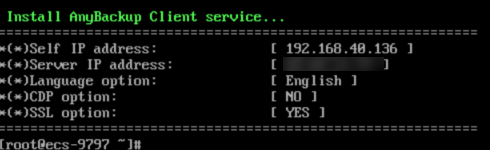
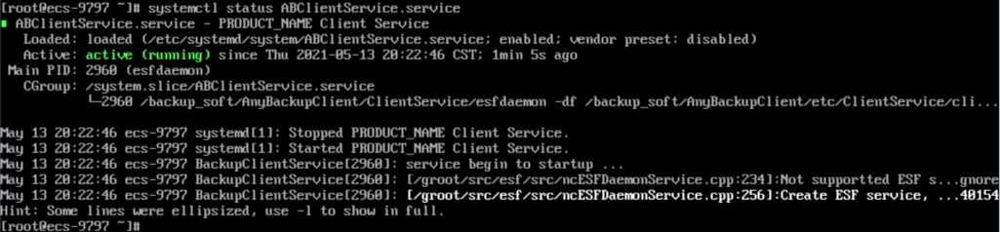
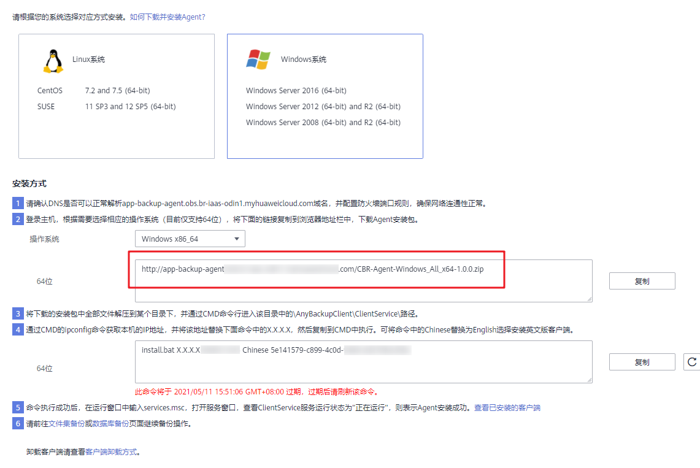
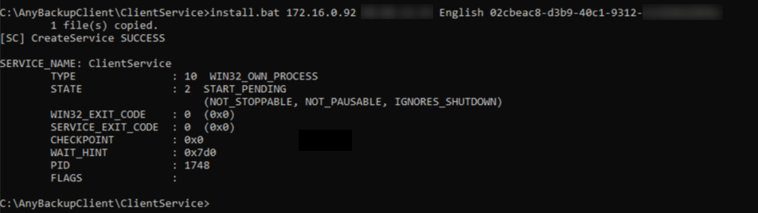
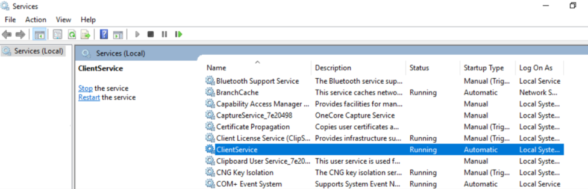

# 下载和安装客户端<a name="cbr_03_0122"></a>

## 操作说明<a name="section18988143101012"></a>

用户启用应用备份前，需先在本地服务器或虚拟机上更改安全组和安装客户端。本章节指导用户下载并安装客户端。

目前仅支持64位操作系统的主机，暂不支持32位操作系统的主机。

## Linux操作步骤<a name="section721412142106"></a>

1.  登录弹性云服务器控制台。
    1.  登录管理控制台。
    2.  单击管理控制台左上角的，选择区域和项目。
    3.  选择“存储 \> 云备份 \> 应用备份 \> 客户端”。

2.  确认DNS是否可以正常解析obs.myhuaweicloud.com域名，确保网络连通性正常。如无法解析，请检查本地网络和通信是否存在问题。
3.  登录主机，在客户端页面选择相应的操作系统，并将界面类似如下的安装命令复制到本地主机中，以root权限运行。

    ```
    wget http://xxx.myhuaweicloud.com/CBR-Agent-Linux_el7_x64-1.0.0.tar.gz && tar -xvf CBR-Agent-Linux_el7_x64-1.0.0.tar.gz && sh install.sh 88.88.xx.xx d77b3628-c108-xxxx-xxxx-xxxxx
    ```

    > **说明：** 
    >参数说明：
    >-   http://xxx.myhuaweicloud.com/xxx.tar.gz：表示获取的安装包路径和安装包名称，不同的操作系统安装包不同，请正确选择对应的操作系统。
    >-   88.88.xx.xx：表示云备份为用户自动分配的弹性IP。
    >-   d77b3628-c108-xxxx-xxxx-xxxxx：表示安装命令的激活码，每个激活码的有效期为一个小时，超过一个小时后需要手动刷新安装命令，否则可能会导致安装包下载安装失败。

4.  安装客户端时，客户端的语言将根据操作系统的语言进行自动选择。
5.  执行复制好的命令安装客户端。

    **图 1**  执行安装命令<a name="fig14929102183415"></a>  
    

6.  安装完成后，执行**systemctl status ABClientService.service**命令查看客户端运行状态。如果运行状态为“active”，则表示客户端安装成功。

    **图 2**  查看客户端运行状态<a name="fig9888101614400"></a>  
    

7.  成功安装客户端后，云备份系统会自动识别已安装客户端的服务器或虚拟机，并显示在“应用备份 \> 客户端 \> 已安装的客户端”中。

## Windows操作步骤<a name="section9243142971217"></a>

1.  登录弹性云服务器控制台。
    1.  登录管理控制台。
    2.  单击管理控制台左上角的，选择区域和项目。
    3.  选择“存储 \> 云备份 \> 应用备份 \> 客户端”。

2.  确认DNS是否可以正常解析obs.myhuaweicloud.com域名，确保网络连通性正常。如无法解析，请检查本地网络和通信是否存在问题。
3.  登录主机，在客户端页面选择相应的操作系统，并将界面类似如下的安装命令复制到本地主机的浏览器地址中，下载客户端安装包。

    ```
    http://xxx.myhuaweicloud.com/CBR-Agent-Windows_All_x64-1.0.0.zip
    ```

4.  将以下安装包链接复制至目标服务器的浏览器中，下载安装包。

    **http://10.246.160.228/app-backup-agent/AppBackup-Agent\_Windows\_All\_x64\_1.0.0.rar**

    **图 3**  获取安装包链接<a name="fig9573193023611"></a>  
    

5.  将下载的安装包中全部文件解压到某个目录下，通过CMD命令行进入安装目录中的**\\AnyBackupClient\\ClientService\\**路径。
6.  通过CMD的ipconfig命令获取本机的IP地址，并将该地址替换下面安装命令中的X.X.X.X，然后复制至CMD中执行。

    ```
    install.bat X.X.X.X 88.88.xx.xx Chinese d77b3628-c108-xxxx-xxxx-xxxxx
    ```

    > **说明：** 
    >参数说明：
    >-   X.X.X.X：本机的IP地址。
    >-   88.88.xx.xx：表示云备份为用户自动分配的弹性IP。
    >-   Chinese：安装中文版的客户端。如果需要安装英文版客户端，需要替换为English。
    >-   d77b3628-c108-xxxx-xxxx-xxxxx：表示安装命令的激活码，每个激活码的有效期为一个小时，超过一个小时后需要手动刷新安装命令，否则可能会导致安装包下载安装失败。

    **图 4**  执行安装命令<a name="fig18402114173912"></a>  
    

7.  命令执行成功后，在运行窗口中输入**services.msc**，打开服务窗口，查看ClientService服务运行状态为“正在运行”，则表示客户端安装成功。

    **图 5**  查看安装状态<a name="fig14323105016289"></a>  
    

8.  完成安装客户端后，云备份系统会自动识别已安装客户端的服务器或虚拟机，并显示在“应用备份 \> 客户端 \> 已安装的客户端”中。

