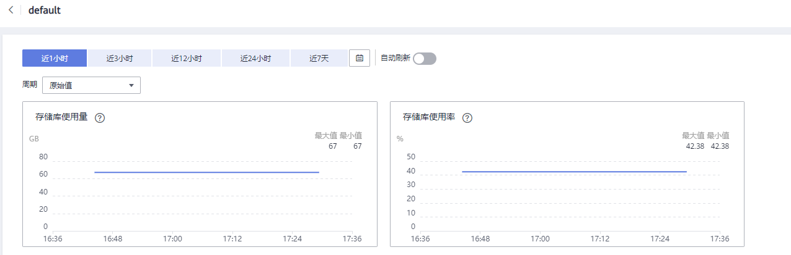

# 云备份监控指标说明

## 功能说明

本节定义了云备份上报用户请求次数的监控指标的命名空间，监控指标列表和维度定义，用户可以通过管理控制台或云监控提供的[API接口](https://support.huaweicloud.com/api-ces/zh-cn_topic_0171212514.html)来查询监控指标。

## 命名空间

SYS.CBR

## 监控指标

<table><thead align="left"><tr id="row42397114153328"><th class="cellrowborder" valign="top" width="14.150000000000002%" id="mcps1.1.7.1.1">
指标

</th>
<th class="cellrowborder" valign="top" width="8.890000000000002%" id="mcps1.1.7.1.2">
指标名称

</th>
<th class="cellrowborder" valign="top" width="33.480000000000004%" id="mcps1.1.7.1.3">
含义

</th>
<th class="cellrowborder" valign="top" width="11.600000000000001%" id="mcps1.1.7.1.4">
取值范围

</th>
<th class="cellrowborder" valign="top" width="17.090000000000003%" id="mcps1.1.7.1.5">
测量对象

</th>
<th class="cellrowborder" valign="top" width="14.790000000000003%" id="mcps1.1.7.1.6">
监控周期（原始指标）

</th>
</tr>
</thead>
<tbody><tr id="row3298232153328"><td class="cellrowborder" valign="top" width="14.150000000000002%" headers="mcps1.1.7.1.1 ">
used_vault_size

</td>
<td class="cellrowborder" valign="top" width="8.890000000000002%" headers="mcps1.1.7.1.2 ">
存储库使用量

</td>
<td class="cellrowborder" valign="top" width="33.480000000000004%" headers="mcps1.1.7.1.3 ">
该指标用于统计存储库使用容量。

单位：GB/秒

</td>
<td class="cellrowborder" valign="top" width="11.600000000000001%" headers="mcps1.1.7.1.4 ">
&gt;=0

</td>
<td class="cellrowborder" valign="top" width="17.090000000000003%" headers="mcps1.1.7.1.5 ">
存储库

</td>
<td class="cellrowborder" valign="top" width="14.790000000000003%" headers="mcps1.1.7.1.6 ">
15min

</td>
</tr>
<tr id="row21884471153328"><td class="cellrowborder" valign="top" width="14.150000000000002%" headers="mcps1.1.7.1.1 ">
vault_util

</td>
<td class="cellrowborder" valign="top" width="8.890000000000002%" headers="mcps1.1.7.1.2 ">
存储库使用率

</td>
<td class="cellrowborder" valign="top" width="33.480000000000004%" headers="mcps1.1.7.1.3 ">
该指标用于统计存储库容量使用率。

</td>
<td class="cellrowborder" valign="top" width="11.600000000000001%" headers="mcps1.1.7.1.4 ">
0~100%

</td>
<td class="cellrowborder" valign="top" width="17.090000000000003%" headers="mcps1.1.7.1.5 ">
存储库

</td>
<td class="cellrowborder" valign="top" width="14.790000000000003%" headers="mcps1.1.7.1.6 ">
15min

</td>
</tr>
</tbody>
</table>

## 维度

<table><thead align="left"><tr id="row64993686153328"><th class="cellrowborder" valign="top" width="40.400000000000006%" id="mcps1.1.3.1.1">
Key

</th>
<th class="cellrowborder" valign="top" width="59.599999999999994%" id="mcps1.1.3.1.2">
Value

</th>
</tr>
</thead>
<tbody><tr id="row48536124153328"><td class="cellrowborder" valign="top" width="40.400000000000006%" headers="mcps1.1.3.1.1 ">
instance_id

</td>
<td class="cellrowborder" valign="top" width="59.599999999999994%" headers="mcps1.1.3.1.2 ">
存储库名称/ID

</td>
</tr>
</tbody>
</table>

## 查看监控数据

1.  登录管理控制台。
2.  进入监控图表页面。
    -   入口一：选择“存储 \> 云备份”，在存储库列表单击查看监控数据的存储库“操作”列下的“更多 \> 查看监控数据”。
    -   入口二：选择“管理与监管 \> 云监控服务\> 云服务监控 \> 云备份”，在存储库列表中，单击待查看监控数据的存储库“操作”列下的“更多 \> 查看监控指标”。

3.  您可以选择监控指标项或者监控时间段，查看对应的存储库监控数据。

    具体存储库的监控图表如[图1](#fig54609244195032)所示，关于云监控的其他操作和更多信息，请参考《云监控用户指南》。

    **图 1**  存储库监控图表  
    

