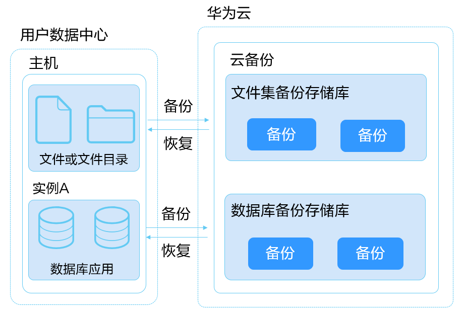

# 什么是应用备份

## 应用备份简介

云备份服务提供了应用备份功能，支持为用户数据中心虚拟机或服务器中的文件和数据库应用进行备份，无需再以整机或整盘的形式进行备份。当数据中心发生人为误删除、软硬件故障等事件时，可将数据恢复到任意备份点。

云备份中的应用备份分为两种：

-   文件集备份：支持备份用户数据中心虚拟机或服务器中的单个或多个文件。
-   数据库备份：支持备份用户数据中心虚拟机或服务器中的数据库应用。

应用备份架构图如[图1](#fig126991751445)所示。

**图 1**  应用备份架构图  

## 文件集备份适用范围

支持本地主机的操作系统列表如[表1](#table31233581051)所示。

**表 1**  文件集备份支持的操作系统

<table><thead align="left"><tr id="row131231258456"><th class="cellrowborder" valign="top" width="35.99%" id="mcps1.2.3.1.1">
操作系统类型

</th>
<th class="cellrowborder" valign="top" width="64.01%" id="mcps1.2.3.1.2">
版本范围

</th>
</tr>
</thead>
<tbody><tr id="row61241558253"><td class="cellrowborder" valign="top" width="35.99%" headers="mcps1.2.3.1.1 ">
Windows

</td>
<td class="cellrowborder" valign="top" width="64.01%" headers="mcps1.2.3.1.2 ">
Windows Server 2008 for x86_64

Windows Server 2008 R2 for x86_64

Windows Server 2012 for x86_64

Windows Server 2012 R2 for x86_64

Windows Server 2016 for x86_64

</td>
</tr>
<tr id="row191243581758"><td class="cellrowborder" valign="top" width="35.99%" headers="mcps1.2.3.1.1 ">
CentOS

</td>
<td class="cellrowborder" valign="top" width="64.01%" headers="mcps1.2.3.1.2 ">
CentOS 7.2 for x86_64

CentOS 7.5 for x86_64

</td>
</tr>
<tr id="row86421479496"><td class="cellrowborder" valign="top" width="35.99%" headers="mcps1.2.3.1.1 ">
SUSE

</td>
<td class="cellrowborder" valign="top" width="64.01%" headers="mcps1.2.3.1.2 ">
SUSE Linux Enterprise Server 11 SP3 for x86_64

SUSE Linux Enterprise Server 12 SP5 for x86_64

</td>
</tr>
</tbody>
</table>

## 数据库备份适用范围

支持本地主机和数据库的操作系统列表如[表2](#table1422572771819)所示。

**表 2**  数据库备份支持的操作系统

<table><thead align="left"><tr id="row822512276183"><th class="cellrowborder" valign="top" width="32.46%" id="mcps1.2.3.1.1">
数据库名称

</th>
<th class="cellrowborder" valign="top" width="67.54%" id="mcps1.2.3.1.2">
版本范围

</th>
</tr>
</thead>
<tbody><tr id="row9225102721819"><td class="cellrowborder" valign="top" width="32.46%" headers="mcps1.2.3.1.1 ">
SQLServer 2008

</td>
<td class="cellrowborder" valign="top" width="67.54%" headers="mcps1.2.3.1.2 ">
Windows Server 2012 R2 for x86_64

</td>
</tr>
<tr id="row722592713181"><td class="cellrowborder" valign="top" width="32.46%" headers="mcps1.2.3.1.1 ">
SQLServer 2008 R2

</td>
<td class="cellrowborder" valign="top" width="67.54%" headers="mcps1.2.3.1.2 ">
Windows Server 2008 for x86_64

</td>
</tr>
<tr id="row52251727191816"><td class="cellrowborder" valign="top" width="32.46%" headers="mcps1.2.3.1.1 ">
SQLServer 2012

</td>
<td class="cellrowborder" valign="top" width="67.54%" headers="mcps1.2.3.1.2 ">
Windows Server 2016 for x86_64

</td>
</tr>
<tr id="row135482014202"><td class="cellrowborder" valign="top" width="32.46%" headers="mcps1.2.3.1.1 ">
SQLServer 2016

</td>
<td class="cellrowborder" valign="top" width="67.54%" headers="mcps1.2.3.1.2 ">
Windows Server 2016 for x86_64

</td>
</tr>
</tbody>
</table>

## 约束限制

**公共**

-   通过克隆已安装客户端主机的方式创建的新主机，需要先卸载新主机的客户端，并删除/var/lib/AnyBackup（Linux系统），再重装客户端。
-   只有离线且没有注册的文件集或数据库的主机，才能被移除。

**文件集备份**

-   目标文件或文件目录名称支持包含特殊字符\_\~\`!@$%^\(\)=-+,
-   目标文件的文件或文件目录路径不能大于4096字节。
-   不支持对含有S属性（即系统属性）的文件或目录进行备份。
-   不建议对正在运行的应用程序的文件进行恢复，建议停止应用程序运行后再执行恢复操作。

**数据库备份**

-   目标数据库名称支持包含特殊字符\_:\~\`!@$%^\*\(\)=-+",.
-   目标数据库名称不能大于100字节。
-   如果重命名已执行过备份的数据库，建议恢复时选择新数据库名称且不覆盖现有数据库，否则可能会恢复失败。

