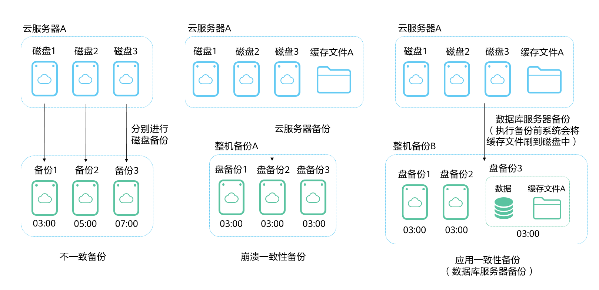
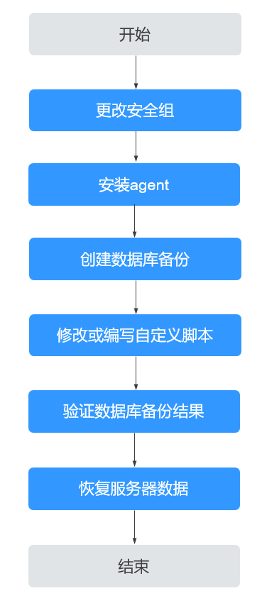

# 什么是数据库服务器备份

## 数据库服务器备份简介

业界对备份一致性的定义包括如下三类：

-   不一致备份：备份的文件、磁盘不在同一个时间点。云备份中的云服务器备份提供对弹性云服务器和裸金属服务器的基于多云硬盘一致性快照技术的数据保护。如果使用云硬盘备份进行多个磁盘单独备份，多个磁盘由于备份时间点不一致，会出现不一致备份。
-   崩溃一致性备份：崩溃一致性备份会捕获备份时磁盘上已存在的数据，文件或磁盘数据在同一时间点，但不会备份内存数据并且静默应用系统，不保证应用系统备份一致性。尽管并未保证应用一致性，但通常情况下，操作系统重启后会进行**chkdsk**等磁盘检查过程来修复各种损坏错误，数据库会进行日志回滚操作保证一致性。
-   应用一致性备份：文件或磁盘数据在同一时间点，并备份内存数据，保证应用系统一致性。

三种不同的备份具体如[图1](#fig865855818567)所示。

云备份同时支持崩溃一致性备份和应用一致性备份（即数据库服务器备份）。下文均将应用一致性备份称为数据库服务器备份。

当云服务器部署MySQL或SAP HANA等数据库，通过云备份的数据库服务器备份功能，可完成对云服务器数据及应用缓存的备份。崩溃一致性备份在不停机期间仅能完成对数据和部分应用缓存的备份。在发生系统故障、数据丢失的事件时，使用数据库服务器备份，即可快速重启业务。而使用崩溃一致性备份可能会出现部分应用配置恢复不完全的情况。

**图 1**  备份一致性  

## 数据库服务器备份与云服务器备份、应用备份的区别

<table><thead align="left"><tr id="row76591917540"><th class="cellrowborder" valign="top" width="12.968703129687032%" id="mcps1.1.5.1.1">
对比维度

</th>
<th class="cellrowborder" valign="top" width="28.22717728227177%" id="mcps1.1.5.1.2">
数据库服务器备份

</th>
<th class="cellrowborder" valign="top" width="29.99700029997%" id="mcps1.1.5.1.3">
服务器备份

</th>
<th class="cellrowborder" valign="top" width="28.8071192880712%" id="mcps1.1.5.1.4">
应用备份中的数据库备份（受限公测）

</th>
</tr>
</thead>
<tbody><tr id="row66600985420"><td class="cellrowborder" valign="top" width="12.968703129687032%" headers="mcps1.1.5.1.1 ">
备份/恢复对象

</td>
<td class="cellrowborder" valign="top" width="28.22717728227177%" headers="mcps1.1.5.1.2 ">
部署MySQL或SAP HANA等数据库应用的云服务器

</td>
<td class="cellrowborder" valign="top" width="29.99700029997%" headers="mcps1.1.5.1.3 ">
不包含数据库等应用的云服务器

</td>
<td class="cellrowborder" valign="top" width="28.8071192880712%" headers="mcps1.1.5.1.4 ">
用户数据中心虚拟机或服务器中的数据库应用

</td>
</tr>
<tr id="row15757040210"><td class="cellrowborder" valign="top" width="12.968703129687032%" headers="mcps1.1.5.1.1 ">
备份粒度

</td>
<td class="cellrowborder" valign="top" width="28.22717728227177%" headers="mcps1.1.5.1.2 ">
云服务器

</td>
<td class="cellrowborder" valign="top" width="29.99700029997%" headers="mcps1.1.5.1.3 ">
云服务器

</td>
<td class="cellrowborder" valign="top" width="28.8071192880712%" headers="mcps1.1.5.1.4 ">
数据库

</td>
</tr>
<tr id="row8127202883018"><td class="cellrowborder" valign="top" width="12.968703129687032%" headers="mcps1.1.5.1.1 ">
存储库类型

</td>
<td class="cellrowborder" valign="top" width="28.22717728227177%" headers="mcps1.1.5.1.2 ">
云服务器备份存储库

</td>
<td class="cellrowborder" valign="top" width="29.99700029997%" headers="mcps1.1.5.1.3 ">
云服务器备份存储库

</td>
<td class="cellrowborder" valign="top" width="28.8071192880712%" headers="mcps1.1.5.1.4 ">
数据库备份存储库

</td>
</tr>
<tr id="row96601391546"><td class="cellrowborder" valign="top" width="12.968703129687032%" headers="mcps1.1.5.1.1 ">
推荐场景

</td>
<td class="cellrowborder" valign="top" width="28.22717728227177%" headers="mcps1.1.5.1.2 ">
云服务器部署了MySQL或SAP HANA等数据库，需要对包含数据库的云服务器进行备份。恢复时能够恢复全部的数据和应用配置。

</td>
<td class="cellrowborder" valign="top" width="29.99700029997%" headers="mcps1.1.5.1.3 ">
云服务器不包含数据库等应用，只需要对数据进行备份。恢复时能够恢复全部的数据。

如果包含MySQL或SAP HANA等数据库的云服务器只进行服务器备份，恢复时可能会出现部分应用配置恢复不完全，重新启用应用时可能会出现问题等情况。

</td>
<td class="cellrowborder" valign="top" width="28.8071192880712%" headers="mcps1.1.5.1.4 ">
需要对用户数据中心虚拟机或服务器中的数据库应用进行单独备份，能够在云上进行备份和恢复。

暂时不支持单独对云上服务器的数据库进行备份。

</td>
</tr>
</tbody>
</table>

## 适用范围

支持安装Agent进行数据库服务器备份的操作系统如[表1](#table18922541392)所示。

**表 1**  支持安装客户端的操作系统列表

<table><thead align="left"><tr id="cbr_03_0021_row17963824406"><th class="cellrowborder" valign="top" width="19%" id="mcps1.2.4.1.1">
数据库名称

</th>
<th class="cellrowborder" valign="top" width="16%" id="mcps1.2.4.1.2">
操作系统类型

</th>
<th class="cellrowborder" valign="top" width="65%" id="mcps1.2.4.1.3">
版本范围

</th>
</tr>
</thead>
<tbody><tr id="cbr_03_0021_row89794274012"><td class="cellrowborder" valign="top" width="19%" headers="mcps1.2.4.1.1 ">
SQLServer 2008/2012

</td>
<td class="cellrowborder" valign="top" width="16%" headers="mcps1.2.4.1.2 ">
Windows

</td>
<td class="cellrowborder" valign="top" width="65%" headers="mcps1.2.4.1.3 ">
Windows Server 2008, 2008 R2, 2012, 2012 R2 for x86_64

</td>
</tr>
<tr id="cbr_03_0021_row129799211400"><td class="cellrowborder" valign="top" width="19%" headers="mcps1.2.4.1.1 ">
SQLServer 2014/2016/EE

</td>
<td class="cellrowborder" valign="top" width="16%" headers="mcps1.2.4.1.2 ">
Windows

</td>
<td class="cellrowborder" valign="top" width="65%" headers="mcps1.2.4.1.3 ">
Windows Server 2012, 2012 R2, 2016 Datacenter for x86_64

</td>
</tr>
<tr id="cbr_03_0021_row397920294015"><td class="cellrowborder" rowspan="4" valign="top" width="19%" headers="mcps1.2.4.1.1 ">
MySQL 5.5/5.6/5.7

</td>
<td class="cellrowborder" valign="top" width="16%" headers="mcps1.2.4.1.2 ">
Red Hat

</td>
<td class="cellrowborder" valign="top" width="65%" headers="mcps1.2.4.1.3 ">
Red Hat Enterprise Linux 6, 7 for x86_64

</td>
</tr>
<tr id="cbr_03_0021_row189792264012"><td class="cellrowborder" valign="top" headers="mcps1.2.4.1.1 ">
SUSE

</td>
<td class="cellrowborder" valign="top" headers="mcps1.2.4.1.2 ">
SUSE Linux Enterprise Server 11, 12, 15 SP1, 15 SP2 for x86_64

</td>
</tr>
<tr id="cbr_03_0021_row097919254017"><td class="cellrowborder" valign="top" headers="mcps1.2.4.1.1 ">
CentOS

</td>
<td class="cellrowborder" valign="top" headers="mcps1.2.4.1.2 ">
CentOS 6, 7 for x86_64

</td>
</tr>
<tr id="cbr_03_0021_row197918220402"><td class="cellrowborder" valign="top" headers="mcps1.2.4.1.1 ">
Euler

</td>
<td class="cellrowborder" valign="top" headers="mcps1.2.4.1.2 ">
Euler OS 2.2, 2.3 for x86_64

</td>
</tr>
<tr id="cbr_03_0021_row18979422401"><td class="cellrowborder" valign="top" width="19%" headers="mcps1.2.4.1.1 ">
HANA 1.0/2.0

</td>
<td class="cellrowborder" valign="top" width="16%" headers="mcps1.2.4.1.2 ">
SUSE

</td>
<td class="cellrowborder" valign="top" width="65%" headers="mcps1.2.4.1.3 ">
SUSE Linux Enterprise Server 12 for x86_64

</td>
</tr>
</tbody>
</table>

兼容性列表以外的数据库，可以参考《云备份最佳实践》的“通过自定义脚本实现其它Linux应用的一致性备份”进行制作自定义脚本完成数据库服务器备份。

## 操作流程

云备份数据库备份的主要流程如[图2](#fig3947184273819)所示。

**图 2**  数据库备份流程图  

1.  更改安全组：使用数据库备份前需要先更改云服务器的安全组。相关操作请参见[更改安全组](更改安全组.md)。
2.  安装agent：更改云服务器的安全组和在云服务器安装agent没有严格的先后顺序，在执行服务器备份前完成两项操作即可。相关操作请参见[安装Agent](安装Agent.md)。
3.  创建数据库备份：在备份服务器前创建数据库备份存储库后，绑定相应的云服务器，即可创建数据库备份。相关操作请参见[创建数据库服务器备份](创建数据库服务器备份.md)。
4.  修改或编写自定义脚本：在完成控制台上的数据库备份后，需要在云服务器中的数据库上修改或编写自定义脚本，才能完成数据库备份。相关操作请参见[通过自定义脚本实现一致性备份](https://support.huaweicloud.com/bestpractice-cbr/cbr_07_0002.html)。
5.  验证数据库备份结果：使用自定义脚本实现数据库备份后，可以通过操作验证数据库备份结果是否成功。相关操作请参见[验证数据库备份结果](https://support.huaweicloud.com/bestpractice-cbr/cbr_07_0014.html)。
6.  恢复服务器数据：可以使用备份恢复云服务器的数据，数据库应用和数据等将与备份时间点的数据保持一致。相关操作请参见[使用云服务器备份恢复数据](使用云服务器备份恢复数据.md)。

