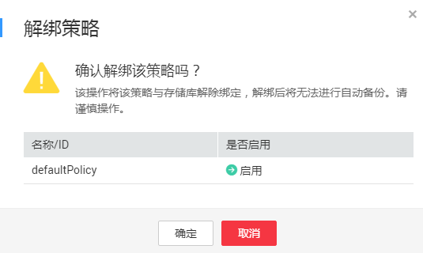

# 从策略中解绑存储库

当绑定策略的存储库不再需要自动备份和复制时，可以从策略中解绑。

## 前提条件

存储库已绑定策略。

## 操作步骤

1.  登录云备份管理控制台。
    1.  登录管理控制台。
    2.  单击管理控制台左上角的，选择区域和项目。
    3.  单击，选择“存储 \> 云备份 ”。

2.  在任一备份页面，找到目标存储库，单击存储库名称查看存储库详情。
3.  在“策略”一栏，单击“解绑策略”。如[图1](#fig16691161117510)所示。

    **图 1**  解绑策略  
    

    > **说明：**   
    >-   当解除策略的存储库中有服务器或磁盘正在执行备份操作，该云服务器可以正常解绑。但是备份任务会继续执行，生成备份。  
    >-   解绑策略后，产生的备份默认不删除。若要删除存储库中的备份，需用户手工删除。  

4.  单击“确定”。存储库将不再按照该策略执行任务。

