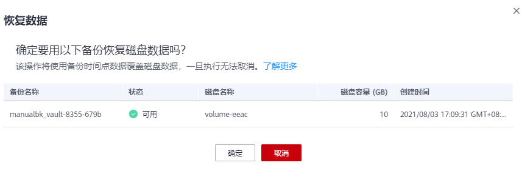

# 使用云硬盘备份恢复数据

您可以根据云硬盘备份将磁盘数据恢复到备份时刻的状态。

目前仅支持将备份恢复至原磁盘中，暂不支持将备份恢复至新的磁盘中。如果希望将备份恢复至其他的磁盘中，可以使用备份创建新的磁盘。

如果希望将数据盘恢复至系统盘上，请参考[如何将数据盘备份恢复至系统盘？](https://support.huaweicloud.com/cbr_faq/cbr_06_0060.html)

暂不支持批量恢复数据操作。

## 前提条件

-   需要恢复的磁盘状态为可用。
-   在恢复数据前，需要先停止服务器，并解除服务器和磁盘的挂载关系后再做恢复操作。恢复后，再挂载磁盘并启动服务器。

## 操作步骤

1.  登录云备份管理控制台。
    1.  登录管理控制台。
    2.  单击管理控制台左上角的，选择区域和项目。
    3.  选择“存储 \> 云备份”。选择对应备份的页签。

2.  选择“备份副本“页签，找到存储库和磁盘所对应的备份，具体操作参见[查看备份](查看备份.md)。
3.  单击备份所在行的“恢复数据”，如[图1](#fig122481021113018)所示。

    > **须知：** 
    >恢复磁盘数据之后将导致备份时间点的数据覆盖磁盘数据，一旦执行，无法回退。

    **图 1**  恢复磁盘  
    

    

4.  根据页面提示，单击“确定“。可以在云硬盘备份副本页面和云硬盘页面确认恢复数据是否成功。

    直到云硬盘备份的“状态”恢复为“可用”时，表示恢复成功。恢复成功的资源数据将于备份时间点保持一致。

5.  恢复完成后，需要将磁盘重新挂载至服务器上，详细操作请参考[挂载云硬盘](https://support.huaweicloud.com/usermanual-evs/evs_01_0075.html)。

