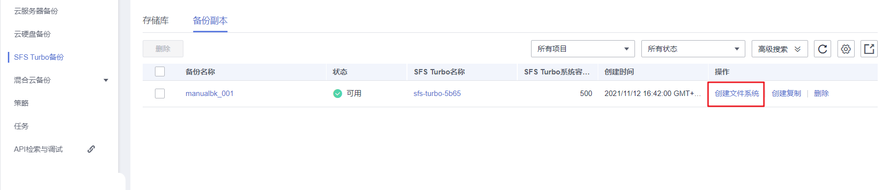
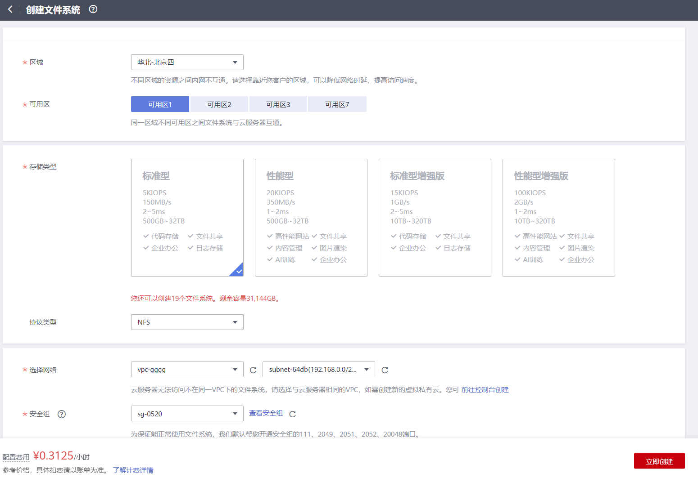

# 使用备份创建新文件系统

当发生病毒入侵、人为误删除、数据丢失等事件时，可以使用SFS Turbo备份数据创建新的文件系统，创建后的文件系统原始数据将会和SFS Turbo备份状态的数据内容相同。

## 操作说明

备份数据为何种类型的文件系统，只能选择该类型的文件系统进行创建。

## 操作步骤

1.  登录云备份管理控制台。
    1.  登录管理控制台。
    2.  单击管理控制台左上角的，选择区域和项目。
    3.  选择“存储 \> 云备份”。选择对应备份的页签。

2.  选择“备份副本“页签，找到存储库和文件系统所对应的备份，具体操作参见[查看备份](查看备份.md)。
3.  目标SFS Turbo备份所在行的“状态”栏为“可用”时，单击“操作”列下单击“创建文件系统“。

    **图 1**  查看备份  
    

    > **说明：** 
    >创建备份请参考《云备份用户指南》的“<u>[购买文件服务备份存储库](https://support.huaweicloud.com/qs-cbr/cbr_02_0010.html)</u>”章节和“<u>[创建文件系统备份](https://support.huaweicloud.com/qs-cbr/cbr_02_0012.html)</u>”章节完成创建备份副本操作。

4.  配置文件系统相关数据。如[\#cbr\_03\_0107/fig126043518315](#fig126043518315)所示。

    **图 2**  创建文件系统  
    

    > **说明：** 
    >-   要了解这些参数的详细说明，请参见《弹性文件服务用户指南》里章节“创建文件系统”中“创建SFS Turbo文件系统”的表格“[参数说明](https://support.huaweicloud.com/qs-sfs/zh-cn_topic_0034428727.html#section3)”的相关参数解释。
    >-   无法修改文件系统的存储类型。
    >-   创建的SFS Turbo文件系统只能为按需计费模式。

5.  单击“立即购买”。

    > **说明：** 
    >您可以选择“按需计费”或“包年/包月”计费模式，两种计费模式的费用有所不同。下面步骤以“包年/包月”为例。

6.  核对文件系统信息，单击“去支付”。
7.  根据界面提示付款，单击“确认付款”。
8.  返回弹性文件服务界面，确认创建新文件系统是否成功。

    文件系统状态要经过“正在创建”、“可用”、“正在恢复”和“可用”四个状态。支持即时恢复特性的情况下由于速度很快，可能无法看到“正在恢复”状态。当状态从“正在创建”变更为“可用”时表示文件系统创建成功。当状态从“正在恢复”变更为“可用”时表示备份数据已成功恢复到创建的文件系统中。

