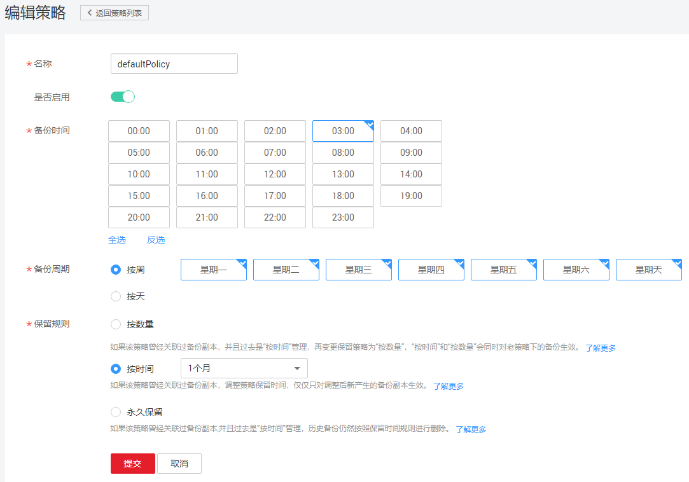

# 修改策略

介绍存储库策略的修改方法。

## 前提条件

已创建至少1个策略。

## 操作步骤

1.  登录云备份管理控制台。
    1.  登录管理控制台。
    2.  单击管理控制台左上角的，选择区域和项目。
    3.  单击，选择“存储 \> 云备份 ”。

2.  在任一备份页面，找到目标存储库，单击存储库名称查看存储库详情。
3.  在“策略”一栏，单击“编辑”。如[图1](#fig12897922174518)所示。

    **图 1**  编辑策略  
    

    参数说明如[表1](创建存储库备份策略.md#table18975142115146)和[表1](创建存储库复制策略.md#table18975142115146)。

4.  单击“确定”。
5.  或者可以在云备份左侧导航栏中的“策略”中修改策略。

