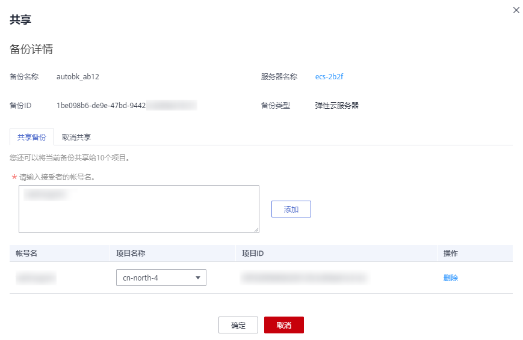
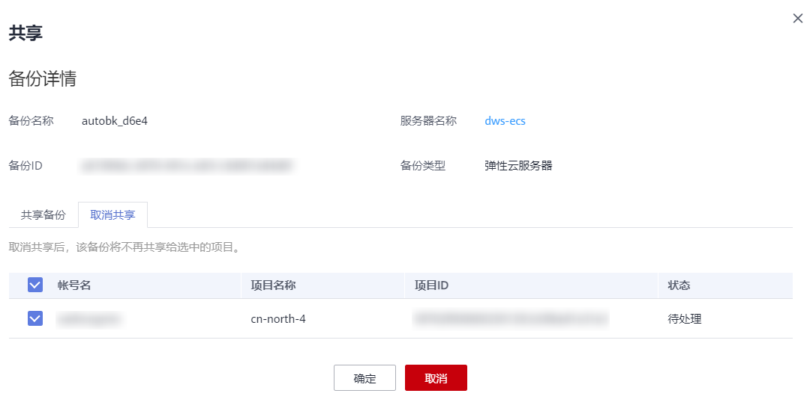
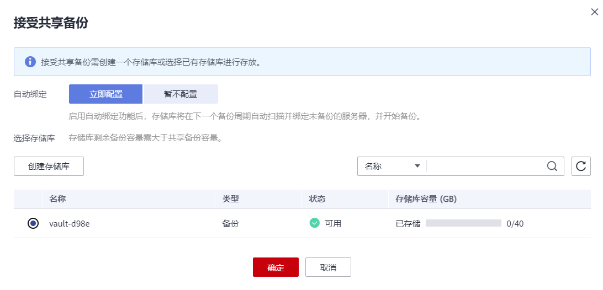
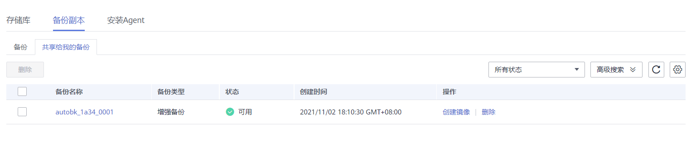

# 共享备份

在对服务器和磁盘数据进行备份后，可将备份共享给其他账户使用。共享的备份可用于创建磁盘或服务器等操作。

## 背景说明

**发起方：**

-   仅支持在同一区域的不同用户间共享。
-   加密备份无法共享。共享的目标项目应与被共享的备份位于同一区域，暂不支持跨区域共享。
-   共享者在删除共享备份后，共享备份接收方的备份也将会被删除。如果共享备份接收方已使用备份创建磁盘或服务器等，则创建的资源不会被删除。

**接受方：**

-   共享备份接收方至少拥有一个备份存储库用于存放共享备份，存储库的剩余容量需要大于接收的共享备份的容量。
-   共享备份接收方可以选择是否接收备份，接收备份后可将备份用于创建新的磁盘或服务器。
-   共享者在删除共享备份后，共享备份接收方的备份也将会被删除。如果共享备份接收方已使用备份创建磁盘或服务器等，则创建的资源不会被删除。

## 发起方操作步骤

1.  登录云备份管理控制台。
    1.  登录管理控制台。
    2.  单击管理控制台左上角的，选择区域和项目。
    3.  选择“存储 \> 云备份”。选择对应备份的页签。

2.  在云服务器备份或云硬盘备份页面，选择“备份副本“页签，通过筛选条件查看备份。
3.  单击目标备份“操作”列下的“更多 \> 共享”，打开共享页面。

    展开的页面显示了该备份的备份名称、服务器名称、备份ID和备份类型。

    -   添加共享

        **图 1**  共享备份  
        

        

    1.  选择“共享备份”页签。
    2.  在输入框中输入待共享目标用户的帐号名。
    3.  单击对话框中的“添加“，待添加的帐号和项目会出现在列表中。可以继续添加帐号。可以将备份共享给10个项目。
    4.  单击“确定“，完成共享添加。

    -   取消共享

    1.  选择目标备份，单击“操作”列下的“更多 \> 共享”。
    2.  选择“取消共享”页签，在弹出的对话框中确认需要删除的共享项目信息，勾选不再需要共享的备份，单击“确定”。如[图2](#fig89741507017)所示。

        **图 2**  取消共享  
        

        

## 接收方操作步骤

1.  登录云备份管理控制台。
    1.  登录管理控制台。
    2.  单击管理控制台左上角的，选择区域和项目。
    3.  选择“存储 \> 云备份”。选择对应备份的页签。

2.  在云服务器备份或云硬盘备份页面，选择“备份副本“页签，切换至“共享给我的备份”。
3.  在接收备份前需要至少拥有一个对应备份类型的备份存储库，存储库创建步骤请参考[创建存储库](https://support.huaweicloud.com/qs-cbr/zh-cn_topic_0170938140.html)。
4.  单击“接受”，在对话框中选择需要存放的存储库。存储库剩余容量需要大于共享备份的容量。如[图3](#fig18151733194710)所示。

    自动绑定：可以根据需要是否配置存储库的自动绑定功能，若选择立即配置则该存储库将会在下一个自动备份周期自动扫描并绑定未备份的服务器，并开始备份。

    **图 3**  接受共享备份  
    

5.  接受成功后，共享备份将会出现在备份副本列表。如[图4](#fig11538583317)所示。

    **图 4**  接受成功  
    

