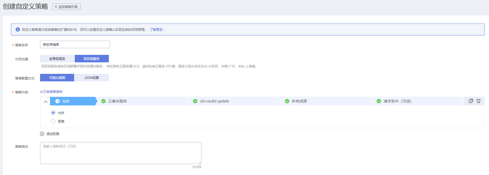
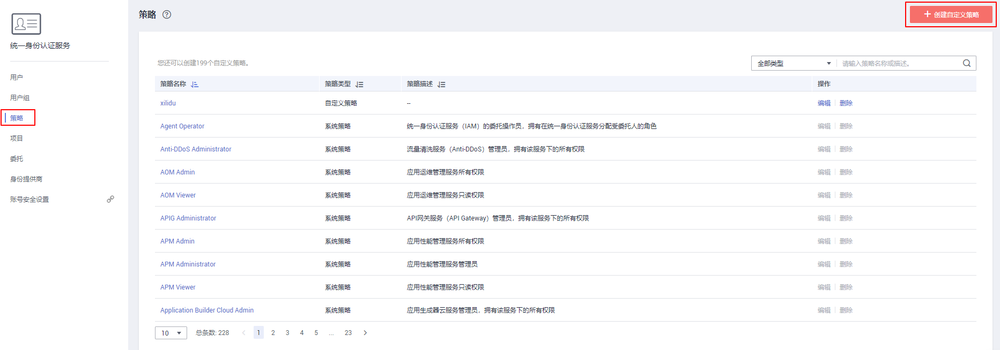
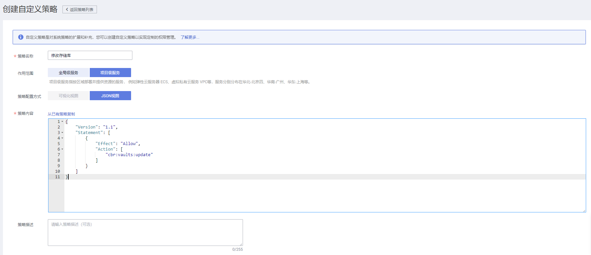

# 创建CBR自定义策略<a name="cbr_03_0050"></a>

如果系统预置的CBR权限，不满足您的授权要求，可以创建自定义策略。自定义策略中可以添加的授权项（Action）请参考[CBR策略及授权项说明](https://support.huaweicloud.com/api-cbr/cbr_04_0017.html)。

目前华为云支持以下两种方式创建自定义策略：

-   可视化视图创建自定义策略：无需了解策略语法，按可视化视图导航栏选择云服务、操作、资源、条件等策略内容，可自动生成策略。
-   JSON视图创建自定义策略：可以在选择策略模板后，根据具体需求编辑策略内容；也可以直接在编辑框内编写JSON格式的策略内容。

如下以定制一个用户仅能修改存储库的策略为例，分别采用可视化视图和JSON视图的配置方式创建自定义策略。

## 前提条件<a name="section49646100511"></a>

-   请先在IAM控制台中开通细粒度策略，开通方法请参见：[申请细粒度访问控制公测](https://support.huaweicloud.com/usermanual-iam/iam_01_019.html)。
-   如需使用JSON视图创建自定义策略，请您先熟悉策略结构，具体请参见[策略语法：细粒度策略](策略语法-细粒度策略.md)。
-   请确定自定义策略需要允许哪些操作，拒绝哪些操作，并获取操作对应的授权项。授权项请参见：[CBR策略及授权项说明](https://support.huaweicloud.com/api-cbr/cbr_04_0017.html)。

## 可视化视图配置自定义策略<a name="section1266453418516"></a>

1.  在IAM控制台，单击左侧导航栏的“策略”，在右上角选择“创建自定义策略”。

    **图 1**  创建自定义策略<a name="fig1829104073015"></a>  
    

2.  在“创建自定义策略”中，配置如下信息：

    **图 2**  可视化视图<a name="fig7630185110304"></a>  
    

    -   “策略名称”：填写“修改存储库”。
    -   “作用范围”：根据服务的属性填写，CBR为项目级服务，选择“项目级服务”。
    -   “策略配置方式”：选择可视化视图。
    -   “策略内容”：
        1.  选择“允许”。
        2.  在“云服务”中选择“云备份”。
        3.  在“操作”中勾选“ReadWrite”中的“cbr:vaults:update”，即“修改存储库”。

    单击“确定”后，自定义策略创建成功。


## JSON视图配置自定义策略<a name="section1066044416818"></a>

如下以创建名为“修改存储库”的策略为例，创建一个仅支持修改存储库的自定义策略。

1.  在IAM控制台，单击左侧导航栏的“策略”，在右上角选择“创建自定义策略”。

    **图 3**  自定义策略<a name="fig2079291113114"></a>  
    

2.  在“创建自定义策略”中，填写如下参数：

    **图 4**  JSON视图<a name="fig87319333315"></a>  
    

    -   “策略名称”：填写“修改存储库”。
    -   “作用范围”：根据服务的属性填写，CBR为项目级服务，选择“项目级服务”。
    -   “策略配置方式”：JSON视图。
    -   “策略内容”：将如下内容拷贝至策略内容中。如下策略表示允许修改存储库。

        ```
        {
              "Version": "1.1",
              "Statement": [
                    {
                          "Effect": "Allow",
                          "Action": [
                                "cbr:vaults:update"
                          ]
                    }
              ]
        }
        ```

3.  单击“确定”后，系统会自动校验语法，如跳转到策略列表，则自定义策略创建成功；如提示“策略内容错误”，请按照语法规范进行修改。

## 验证自定义策略权限<a name="section4943933205920"></a>

1.  将新创建的自定义策略授予用户组，使得用户组中的用户仅具备修改存储库的权限。
2.  用户登录并验证自定义策略定义的权限：修改存储库。

    权限授予成功后，用户可以通过控制台以及REST API等多种方式验证。此处以登录控制台为例，介绍用户如何验证修改存储库的权限。

    1.  使用新创建的用户登录华为云，登录方法选择为“IAM用户登录”。
        -   账号名为该IAM用户所属华为云账号的名称。
        -   用户名和密码为账号在IAM创建用户时输入的用户名和密码。

    2.  在云备份页面，进行修改存储库操作，操作成功，权限配置正确并已生效。
    3.  尝试进行其他操作，例如：创建存储库

        系统显示“权限不足”，权限配置正确并已生效。


## 策略样例<a name="section441833517360"></a>

-   示例1：授权用户创建、修改和删除存储库

    ```
    {
          "Version": "1.1",
          "Statement": [
                {
                      "Effect": "Allow",
                      "Action": [
                            "cbr:*:get*",
                            "cbr:*:list*",
                            "cbr:vaults:update",
                            "cbr:vaults:delete",
                            "cbr:vaults:create"
                      ]
                }
          ]
    }
    ```

-   示例2：拒绝用户删除存储库

    拒绝策略需要同时配合其他策略使用，否则没有实际作用。用户被授予的策略中，一个授权项的作用如果同时存在Allow和Deny，则遵循Deny优先。

    如果您给用户授予CBR Administrator的系统策略，但不希望用户拥有CBR Administrator中定义的删除存储库权限，您可以创建一条拒绝删除存储库的自定义策略，然后同时将CBR Administrator和拒绝策略授予用户，根据Deny优先原则，则用户可以对CBR执行除了删除存储库外的所有操作。拒绝策略示例如下：

    ```
    {
          "Version": "1.1",
          "Statement": [
                {
                      "Effect": "Deny",
                      "Action": [
                            "cbr:vaults:delete"
                      ]
                }
          ]
    }
    ```


