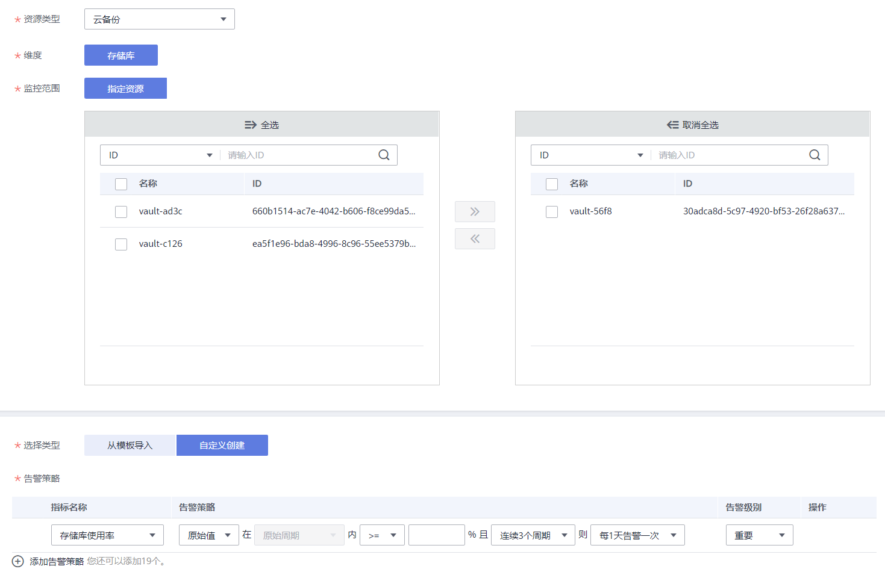
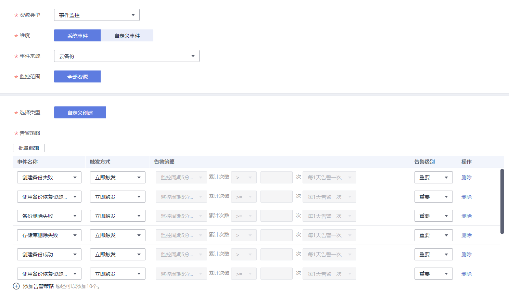

# 创建告警规则

本章节指导用户如何创建云备份的告警规则。

混合云备份仅支持对存储库容量进行监控，暂不支持对云下操作以及事件进行监控。

## 创建告警规则

1.  登录管理控制台。
2.  单击“管理与监管 \> 云监控 \> 云服务监控 \> 云备份” 。
3.  选择目标存储库，单击“操作”列下的“创建告警规则”。
4.  在“创建告警规则”界面，根据界面提示配置参数。
    1.  根据界面提示，配置规则信息参数。

        **图 1**  配置规则信息  
        

        **表 1**  配置规则信息

        
        <table><thead align="left"><tr id="row18694135418312"><th class="cellrowborder" valign="top" width="14.97%" id="mcps1.2.4.1.1">
参数

        </th>
        <th class="cellrowborder" valign="top" width="62.96000000000001%" id="mcps1.2.4.1.2">
参数说明

        </th>
        <th class="cellrowborder" valign="top" width="22.07%" id="mcps1.2.4.1.3">
取值样例

        </th>
        </tr>
        </thead>
        <tbody><tr id="row17694105423111"><td class="cellrowborder" valign="top" width="14.97%" headers="mcps1.2.4.1.1 ">
名称

        </td>
        <td class="cellrowborder" valign="top" width="62.96000000000001%" headers="mcps1.2.4.1.2 ">
系统会随机产生一个名称，用户也可以进行修改。

        </td>
        <td class="cellrowborder" valign="top" width="22.07%" headers="mcps1.2.4.1.3 ">
alarm-cgnw

        </td>
        </tr>
        <tr id="row13694165413316"><td class="cellrowborder" valign="top" width="14.97%" headers="mcps1.2.4.1.1 ">
描述

        </td>
        <td class="cellrowborder" valign="top" width="62.96000000000001%" headers="mcps1.2.4.1.2 ">
告警规则描述（此参数非必填项）。

        </td>
        <td class="cellrowborder" valign="top" width="22.07%" headers="mcps1.2.4.1.3 ">
-

        </td>
        </tr>
        </tbody>
        </table>

    2.  配置告警内容参数。

        **图 2**  云备份存储库告警配置  
        

        **图 3**  云备份事件告警配置  
        

        -   如果“资源类型”选择“云备份”，则可以监控存储库维度的两个指标。参数说明如[表2](#table15644526289)所示。

            **表 2**  配置告警内容

            
            <table><thead align="left"><tr id="row556425282819"><th class="cellrowborder" valign="top" width="14.970000000000002%" id="mcps1.2.4.1.1">
参数

            </th>
            <th class="cellrowborder" valign="top" width="63.73000000000001%" id="mcps1.2.4.1.2">
参数说明

            </th>
            <th class="cellrowborder" valign="top" width="21.3%" id="mcps1.2.4.1.3">
取值样例

            </th>
            </tr>
            </thead>
            <tbody><tr id="row735319918293"><td class="cellrowborder" valign="top" width="14.970000000000002%" headers="mcps1.2.4.1.1 ">
资源类型

            </td>
            <td class="cellrowborder" valign="top" width="63.73000000000001%" headers="mcps1.2.4.1.2 ">
此处以选择“云备份”为例。

            </td>
            <td class="cellrowborder" valign="top" width="21.3%" headers="mcps1.2.4.1.3 ">
云备份

            </td>
            </tr>
            <tr id="row063028133020"><td class="cellrowborder" valign="top" width="14.970000000000002%" headers="mcps1.2.4.1.1 ">
维度

            </td>
            <td class="cellrowborder" valign="top" width="63.73000000000001%" headers="mcps1.2.4.1.2 ">
默认以“存储库”为维度进行监控。

            </td>
            <td class="cellrowborder" valign="top" width="21.3%" headers="mcps1.2.4.1.3 ">
存储库

            </td>
            </tr>
            <tr id="row19959154233018"><td class="cellrowborder" valign="top" width="14.970000000000002%" headers="mcps1.2.4.1.1 ">
监控范围

            </td>
            <td class="cellrowborder" valign="top" width="63.73000000000001%" headers="mcps1.2.4.1.2 ">
根据业务需求勾选监控的存储库。

            </td>
            <td class="cellrowborder" valign="top" width="21.3%" headers="mcps1.2.4.1.3 ">
vault-56f8

            </td>
            </tr>
            <tr id="row16565352152817"><td class="cellrowborder" valign="top" width="14.970000000000002%" headers="mcps1.2.4.1.1 ">
选择类型

            </td>
            <td class="cellrowborder" valign="top" width="63.73000000000001%" headers="mcps1.2.4.1.2 ">
根据需要可选择从模板导入或自定义创建。

            
 说明： 

当监控范围为指定资源时可选择从模板导入。

            

            </td>
            <td class="cellrowborder" valign="top" width="21.3%" headers="mcps1.2.4.1.3 ">
从模板导入

            </td>
            </tr>
            <tr id="row165651552172818"><td class="cellrowborder" valign="top" width="14.970000000000002%" headers="mcps1.2.4.1.1 ">
模板

            </td>
            <td class="cellrowborder" valign="top" width="63.73000000000001%" headers="mcps1.2.4.1.2 ">
选择需要导入的模板。

            </td>
            <td class="cellrowborder" valign="top" width="21.3%" headers="mcps1.2.4.1.3 ">
-

            </td>
            </tr>
            <tr id="row1565205282816"><td class="cellrowborder" valign="top" width="14.970000000000002%" headers="mcps1.2.4.1.1 ">
告警策略

            </td>
            <td class="cellrowborder" valign="top" width="63.73000000000001%" headers="mcps1.2.4.1.2 ">
触发告警规则的告警策略。

            
当资源类型选择具体的云服务时，告警策略为一个周期性的动作。当资源类型选择事件监控时，具体的事件为一个瞬间的操作动作，而不是周期性动作。目前支持配置的云备份告警策略有：

            <ul id="ul1281351133212"><li>存储库使用率</li><li>存储库使用量</li></ul>
            </td>
            <td class="cellrowborder" valign="top" width="21.3%" headers="mcps1.2.4.1.3 ">
-

            </td>
            </tr>
            <tr id="row145653523287"><td class="cellrowborder" valign="top" width="14.970000000000002%" headers="mcps1.2.4.1.1 ">
告警级别

            </td>
            <td class="cellrowborder" valign="top" width="63.73000000000001%" headers="mcps1.2.4.1.2 ">
根据告警的严重程度不同等级，可选择紧急、重要、次要、提示。

            </td>
            <td class="cellrowborder" valign="top" width="21.3%" headers="mcps1.2.4.1.3 ">
重要

            </td>
            </tr>
            </tbody>
            </table>

        -   如果“资源类型”选择“事件监控”，则可以针对云备份服务的多个事件进行监控。参数说明如[表2](#table15644526289)所示。

            **表 3**  配置告警内容

            
            <table><thead align="left"><tr id="row83801627452"><th class="cellrowborder" valign="top" width="14.970000000000002%" id="mcps1.2.4.1.1">
参数

            </th>
            <th class="cellrowborder" valign="top" width="63.73000000000001%" id="mcps1.2.4.1.2">
参数说明

            </th>
            <th class="cellrowborder" valign="top" width="21.3%" id="mcps1.2.4.1.3">
取值样例

            </th>
            </tr>
            </thead>
            <tbody><tr id="row13813213455"><td class="cellrowborder" valign="top" width="14.970000000000002%" headers="mcps1.2.4.1.1 ">
资源类型

            </td>
            <td class="cellrowborder" valign="top" width="63.73000000000001%" headers="mcps1.2.4.1.2 ">
此处以选择“事件监控”为例。

            </td>
            <td class="cellrowborder" valign="top" width="21.3%" headers="mcps1.2.4.1.3 ">
事件监控

            </td>
            </tr>
            <tr id="row838117220458"><td class="cellrowborder" valign="top" width="14.970000000000002%" headers="mcps1.2.4.1.1 ">
维度

            </td>
            <td class="cellrowborder" valign="top" width="63.73000000000001%" headers="mcps1.2.4.1.2 ">
用于指定告警规则对应指标的维度名称。

            </td>
            <td class="cellrowborder" valign="top" width="21.3%" headers="mcps1.2.4.1.3 ">
系统事件

            </td>
            </tr>
            <tr id="row938116216452"><td class="cellrowborder" valign="top" width="14.970000000000002%" headers="mcps1.2.4.1.1 ">
监控范围

            </td>
            <td class="cellrowborder" valign="top" width="63.73000000000001%" headers="mcps1.2.4.1.2 ">
创建事件监控针对的资源范围。

            
默认取值：全部资源

            </td>
            <td class="cellrowborder" valign="top" width="21.3%" headers="mcps1.2.4.1.3 ">
-

            </td>
            </tr>
            <tr id="row12381152154514"><td class="cellrowborder" valign="top" width="14.970000000000002%" headers="mcps1.2.4.1.1 ">
选择类型

            </td>
            <td class="cellrowborder" valign="top" width="63.73000000000001%" headers="mcps1.2.4.1.2 ">
选择自定义创建。

            </td>
            <td class="cellrowborder" valign="top" width="21.3%" headers="mcps1.2.4.1.3 ">
自定义创建

            </td>
            </tr>
            <tr id="row133811422455"><td class="cellrowborder" valign="top" width="14.970000000000002%" headers="mcps1.2.4.1.1 ">
告警策略

            </td>
            <td class="cellrowborder" valign="top" width="63.73000000000001%" headers="mcps1.2.4.1.2 ">
触发告警规则的告警策略。

            
目前支持配置的云备份事件告警如<a href="#table12179172910594">表4</a>所示。

            </td>
            <td class="cellrowborder" valign="top" width="21.3%" headers="mcps1.2.4.1.3 ">
-

            </td>
            </tr>
            </tbody>
            </table>

            **表 4**  云备份事件告警规则

            
            <table><thead align="left"><tr id="row17579429125919"><th class="cellrowborder" valign="top" width="12.03879612038796%" id="mcps1.2.7.1.1">
事件来源

            </th>
            <th class="cellrowborder" valign="top" width="20.95790420957904%" id="mcps1.2.7.1.2">
事件名称

            </th>
            <th class="cellrowborder" valign="top" width="16.98830116988301%" id="mcps1.2.7.1.3">
事件级别

            </th>
            <th class="cellrowborder" valign="top" width="16.98830116988301%" id="mcps1.2.7.1.4">
事件说明

            </th>
            <th class="cellrowborder" valign="top" width="16.03839616038396%" id="mcps1.2.7.1.5">
处理建议

            </th>
            <th class="cellrowborder" valign="top" width="16.98830116988301%" id="mcps1.2.7.1.6">
事件影响

            </th>
            </tr>
            </thead>
            <tbody><tr id="row12579729155911"><td class="cellrowborder" rowspan="10" valign="top" width="12.03879612038796%" headers="mcps1.2.7.1.1 ">
CBR

            </td>
            <td class="cellrowborder" valign="top" width="20.95790420957904%" headers="mcps1.2.7.1.2 ">
备份失败

            </td>
            <td class="cellrowborder" valign="top" width="16.98830116988301%" headers="mcps1.2.7.1.3 ">
紧急

            </td>
            <td class="cellrowborder" valign="top" width="16.98830116988301%" headers="mcps1.2.7.1.4 ">
创建备份失败

            </td>
            <td class="cellrowborder" valign="top" width="16.03839616038396%" headers="mcps1.2.7.1.5 ">
尝试手动创建备份或者联系客服

            </td>
            <td class="cellrowborder" valign="top" width="16.98830116988301%" headers="mcps1.2.7.1.6 ">
可能造成数据丢失

            </td>
            </tr>
            <tr id="row7579122955911"><td class="cellrowborder" valign="top" headers="mcps1.2.7.1.1 ">
恢复失败

            </td>
            <td class="cellrowborder" valign="top" headers="mcps1.2.7.1.2 ">
紧急

            </td>
            <td class="cellrowborder" valign="top" headers="mcps1.2.7.1.3 ">
使用备份恢复资源失败

            </td>
            <td class="cellrowborder" valign="top" headers="mcps1.2.7.1.4 ">
尝试使用其他备份恢复或者联系客服

            </td>
            <td class="cellrowborder" valign="top" headers="mcps1.2.7.1.5 ">
可能造成数据丢失

            </td>
            </tr>
            <tr id="row145791429145914"><td class="cellrowborder" valign="top" headers="mcps1.2.7.1.1 ">
备份删除失败

            </td>
            <td class="cellrowborder" valign="top" headers="mcps1.2.7.1.2 ">
紧急

            </td>
            <td class="cellrowborder" valign="top" headers="mcps1.2.7.1.3 ">
备份删除失败

            </td>
            <td class="cellrowborder" valign="top" headers="mcps1.2.7.1.4 ">
稍后重试删除或者联系客服

            </td>
            <td class="cellrowborder" valign="top" headers="mcps1.2.7.1.5 ">
可能造成计费异常

            </td>
            </tr>
            <tr id="row14579729175914"><td class="cellrowborder" valign="top" headers="mcps1.2.7.1.1 ">
存储库删除失败

            </td>
            <td class="cellrowborder" valign="top" headers="mcps1.2.7.1.2 ">
紧急

            </td>
            <td class="cellrowborder" valign="top" headers="mcps1.2.7.1.3 ">
储存库删除失败

            </td>
            <td class="cellrowborder" valign="top" headers="mcps1.2.7.1.4 ">
稍后重试或联系客服

            </td>
            <td class="cellrowborder" valign="top" headers="mcps1.2.7.1.5 ">
可能造成计费异常

            </td>
            </tr>
            <tr id="row1957919291591"><td class="cellrowborder" valign="top" headers="mcps1.2.7.1.1 ">
备份复制失败

            </td>
            <td class="cellrowborder" valign="top" headers="mcps1.2.7.1.2 ">
紧急

            </td>
            <td class="cellrowborder" valign="top" headers="mcps1.2.7.1.3 ">
备份复制失败

            </td>
            <td class="cellrowborder" valign="top" headers="mcps1.2.7.1.4 ">
稍后重试或联系客服

            </td>
            <td class="cellrowborder" valign="top" headers="mcps1.2.7.1.5 ">
可能造成数据丢失

            </td>
            </tr>
            <tr id="row10580152913596"><td class="cellrowborder" valign="top" headers="mcps1.2.7.1.1 ">
备份成功

            </td>
            <td class="cellrowborder" valign="top" headers="mcps1.2.7.1.2 ">
重要

            </td>
            <td class="cellrowborder" valign="top" headers="mcps1.2.7.1.3 ">
创建备份成功

            </td>
            <td class="cellrowborder" valign="top" headers="mcps1.2.7.1.4 ">
无

            </td>
            <td class="cellrowborder" valign="top" headers="mcps1.2.7.1.5 ">
无

            </td>
            </tr>
            <tr id="row14580102918599"><td class="cellrowborder" valign="top" headers="mcps1.2.7.1.1 ">
恢复成功

            </td>
            <td class="cellrowborder" valign="top" headers="mcps1.2.7.1.2 ">
重要

            </td>
            <td class="cellrowborder" valign="top" headers="mcps1.2.7.1.3 ">
使用备份恢复资源成功

            </td>
            <td class="cellrowborder" valign="top" headers="mcps1.2.7.1.4 ">
观察数据是否已成功恢复。

            </td>
            <td class="cellrowborder" valign="top" headers="mcps1.2.7.1.5 ">
无

            </td>
            </tr>
            <tr id="row75801329175915"><td class="cellrowborder" valign="top" headers="mcps1.2.7.1.1 ">
备份删除成功

            </td>
            <td class="cellrowborder" valign="top" headers="mcps1.2.7.1.2 ">
重要

            </td>
            <td class="cellrowborder" valign="top" headers="mcps1.2.7.1.3 ">
备份删除成功

            </td>
            <td class="cellrowborder" valign="top" headers="mcps1.2.7.1.4 ">
无

            </td>
            <td class="cellrowborder" valign="top" headers="mcps1.2.7.1.5 ">
无

            </td>
            </tr>
            <tr id="row4580192935911"><td class="cellrowborder" valign="top" headers="mcps1.2.7.1.1 ">
存储库删除成功

            </td>
            <td class="cellrowborder" valign="top" headers="mcps1.2.7.1.2 ">
重要

            </td>
            <td class="cellrowborder" valign="top" headers="mcps1.2.7.1.3 ">
存储库删除成功

            </td>
            <td class="cellrowborder" valign="top" headers="mcps1.2.7.1.4 ">
无

            </td>
            <td class="cellrowborder" valign="top" headers="mcps1.2.7.1.5 ">
无

            </td>
            </tr>
            <tr id="row12580162945917"><td class="cellrowborder" valign="top" headers="mcps1.2.7.1.1 ">
备份复制成功

            </td>
            <td class="cellrowborder" valign="top" headers="mcps1.2.7.1.2 ">
重要

            </td>
            <td class="cellrowborder" valign="top" headers="mcps1.2.7.1.3 ">
备份复制成功

            </td>
            <td class="cellrowborder" valign="top" headers="mcps1.2.7.1.4 ">
无

            </td>
            <td class="cellrowborder" valign="top" headers="mcps1.2.7.1.5 ">
无

            </td>
            </tr>
            </tbody>
            </table>

    3.  根据界面提示，配置告警通知参数。

        **图 4**  配置告警通知  
        

        **表 5**  配置告警通知

        
        <table><thead align="left"><tr id="row13415173554216"><th class="cellrowborder" valign="top" width="14.970000000000002%" id="mcps1.2.4.1.1">
参数

        </th>
        <th class="cellrowborder" valign="top" width="64.35000000000001%" id="mcps1.2.4.1.2">
参数说明

        </th>
        <th class="cellrowborder" valign="top" width="20.680000000000003%" id="mcps1.2.4.1.3">
取值样例

        </th>
        </tr>
        </thead>
        <tbody><tr id="row3415103514420"><td class="cellrowborder" valign="top" width="14.970000000000002%" headers="mcps1.2.4.1.1 ">
发送通知

        </td>
        <td class="cellrowborder" valign="top" width="64.35000000000001%" headers="mcps1.2.4.1.2 ">
配置是否发送邮件、短信、HTTP和HTTPS通知用户。

        
启用（推荐选择），会发送通知；不启用，不会发送通知。

        </td>
        <td class="cellrowborder" valign="top" width="20.680000000000003%" headers="mcps1.2.4.1.3 ">
-

        </td>
        </tr>
        <tr id="row18415153564213"><td class="cellrowborder" valign="top" width="14.970000000000002%" headers="mcps1.2.4.1.1 ">
生效时间

        </td>
        <td class="cellrowborder" valign="top" width="64.35000000000001%" headers="mcps1.2.4.1.2 ">
该告警规则仅在生效时间内发送通知消息。

        
如生效时间为00:00-8:00，则该告警规则仅在00:00-8:00发送通知消息。

        </td>
        <td class="cellrowborder" valign="top" width="20.680000000000003%" headers="mcps1.2.4.1.3 ">
-

        </td>
        </tr>
        <tr id="row164156354426"><td class="cellrowborder" valign="top" width="14.970000000000002%" headers="mcps1.2.4.1.1 ">
通知对象

        </td>
        <td class="cellrowborder" valign="top" width="64.35000000000001%" headers="mcps1.2.4.1.2 ">
需要发送告警通知的主题名称。

        
当发送通知选择“是”时，需要选择已有的主题名称，若此处没有需要的主题则需先创建主题，该功能会调用消息通知服务（SMN），创建主题请参见《消息通知服务用户指南》。

        </td>
        <td class="cellrowborder" valign="top" width="20.680000000000003%" headers="mcps1.2.4.1.3 ">
-

        </td>
        </tr>
        <tr id="row1416153504210"><td class="cellrowborder" valign="top" width="14.970000000000002%" headers="mcps1.2.4.1.1 ">
触发条件

        </td>
        <td class="cellrowborder" valign="top" width="64.35000000000001%" headers="mcps1.2.4.1.2 ">
可以选择“出现告警”、“恢复正常”两种状态，作为触发告警通知的条件。

        </td>
        <td class="cellrowborder" valign="top" width="20.680000000000003%" headers="mcps1.2.4.1.3 ">
-

        </td>
        </tr>
        </tbody>
        </table>

    4.  配置完成后，单击“立即创建”，完成告警规则的创建。

告警规则添加完成后，当监控指标触发设定的阈值或发生相关的云备份事件时，云监控会在第一时间通过消息通知服务实时告知您云备份资源异常，以免因此造成业务损失。其他详细操作可参考《云监控用户指南》。

