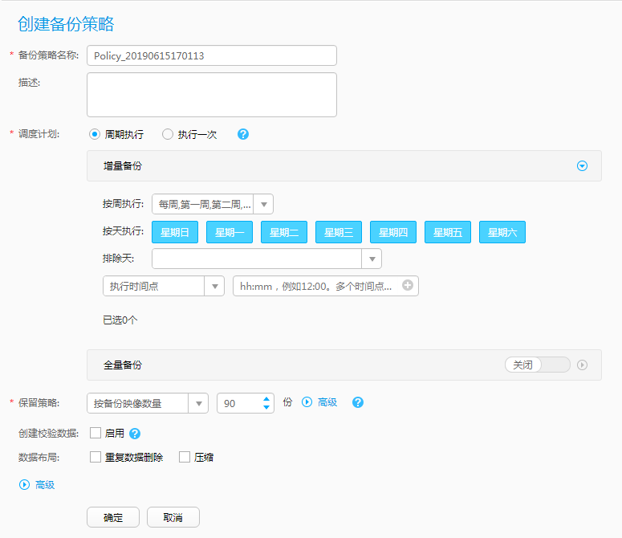

# 创建备份策略

备份策略定义了执行备份任务和生成备份副本的规则。对备份计划设置备份策略后，才能执行备份任务。您可以灵活地创建不同的备份策略，以满足不同的备份需求。

## 操作步骤

1.  在导航栏上选择“  \> 备份策略”。
2.  单击“创建”。
3.  设置备份策略基本信息，相关参数说明如[表1](#zh-cn_topic_0174982641_zh-cn_topic_0170955590_table4173735161316)所示。

    **图 1**  创建保护集备份策略  
    

    **表 1**  备份策略参数说明

    
    <table><thead align="left"><tr id="zh-cn_topic_0174982641_zh-cn_topic_0170955590_row1416033514131"><th class="cellrowborder" valign="top" width="14.288571142885711%" id="mcps1.2.4.1.1">
参数名称

    </th>
    <th class="cellrowborder" valign="top" width="40.815918408159185%" id="mcps1.2.4.1.2">
参数说明

    </th>
    <th class="cellrowborder" valign="top" width="44.89551044895511%" id="mcps1.2.4.1.3">
设置原则

    </th>
    </tr>
    </thead>
    <tbody><tr id="zh-cn_topic_0174982641_zh-cn_topic_0170955590_row516033518135"><td class="cellrowborder" valign="top" width="14.288571142885711%" headers="mcps1.2.4.1.1 ">
备份策略名称

    </td>
    <td class="cellrowborder" valign="top" width="40.815918408159185%" headers="mcps1.2.4.1.2 ">
用户自定义的备份策略名称。

    </td>
    <td class="cellrowborder" valign="top" width="44.89551044895511%" headers="mcps1.2.4.1.3 ">
名称长度范围为1到128位，只能由字母、数字、中文字符、“+”、“_”、“-”、“.”、“@”组成。

    </td>
    </tr>
    <tr id="zh-cn_topic_0174982641_zh-cn_topic_0170955590_row1161113514139"><td class="cellrowborder" valign="top" width="14.288571142885711%" headers="mcps1.2.4.1.1 ">
描述

    </td>
    <td class="cellrowborder" valign="top" width="40.815918408159185%" headers="mcps1.2.4.1.2 ">
备份策略的描述。

    </td>
    <td class="cellrowborder" valign="top" width="44.89551044895511%" headers="mcps1.2.4.1.3 ">
描述信息不能超过1024个字符。

    </td>
    </tr>
    <tr id="zh-cn_topic_0174982641_zh-cn_topic_0170955590_row7163193513135"><td class="cellrowborder" valign="top" width="14.288571142885711%" headers="mcps1.2.4.1.1 ">
调度计划

    </td>
    <td class="cellrowborder" valign="top" width="40.815918408159185%" headers="mcps1.2.4.1.2 ">
备份策略的备份任务执行计划。可设置“周期执行”和“执行一次”两种状态。

    
“调度计划”设置为“周期执行”时，需要设置增量备份的调度计划，也可根据需要选择是否开启周期性全量备份，参数说明如下：

    
 说明： 

在同一时间点同时设置了增量备份和全量备份调度计划，系统会优先执行全量备份。

    

    <ul id="zh-cn_topic_0174982641_zh-cn_topic_0170955590_ul7162163515139"><li>按周执行：按照每周或每月第几周的固定日期执行备份。</li><li>按天执行：按照指定的时间（星期几）执行备份，与“按周执行”配合进行设置。例如设置为“每月第一周的星期三和星期日执行备份”。</li><li>排除天：排除每月的指定日期，即系统将不会在设定的这些天内执行备份任务。</li><li>执行时间点：设置备份任务具体的执行时间点，系统将在指定时间自动进行调度。可以设置一个或者多个时间点。系统将按照用户设置的时间点依次执行备份任务。</li><li>执行时间段：设置在具体的时间范围内按照指定的时间间隔执行多次备份。可以设置一个或者多个时间段。</li></ul>
    
 说明： 
<ul id="zh-cn_topic_0174982641_zh-cn_topic_0170955590_ul111631835111315"><li>如果一次备份任务M在指定的时间间隔内未执行完成，将不会启动下一次备份任务。直到备份任务M执行完成后，系统按照指定的时间间隔继续执行备份任务。</li><li>如果在指定的时间间隔内向备份计划关联的保护集中新增虚拟机VM1，当一次备份任务N在指定的时间间隔内未执行完成，在到达时间间隔后，系统将启动对虚拟机VM1的备份任务。</li><li>当超过指定的时间范围时，如果有备份任务正在执行，将继续执行完成；如果有备份任务处于“等待调度”状态，将不会再执行备份任务。</li></ul>
    

    </td>
    <td class="cellrowborder" valign="top" width="44.89551044895511%" headers="mcps1.2.4.1.3 ">
对数据的备份越频繁，对数据的保护越充分，但是备份的时间也越长，所需的备份时间越长，占用的空间也越大。请根据数据的重要级别和业务量综合考虑选择，重要的数据采用较高的备份频率。

    </td>
    </tr>
    <tr id="zh-cn_topic_0174982641_zh-cn_topic_0170955590_row216443581316"><td class="cellrowborder" valign="top" width="14.288571142885711%" headers="mcps1.2.4.1.1 ">
执行一次

    </td>
    <td class="cellrowborder" valign="top" width="40.815918408159185%" headers="mcps1.2.4.1.2 ">
备份策略的备份任务只执行一次，此时需要设置备份策略的执行时间。此类型仅针对全量备份。“调度计划”设置为“执行一次”时，该参数可见。

    </td>
    <td class="cellrowborder" valign="top" width="44.89551044895511%" headers="mcps1.2.4.1.3 ">
设置的执行时间需要晚于当前系统时间。

    </td>
    </tr>
    <tr id="zh-cn_topic_0174982641_zh-cn_topic_0170955590_row5168135191316"><td class="cellrowborder" valign="top" width="14.288571142885711%" headers="mcps1.2.4.1.1 ">
保留策略

    </td>
    <td class="cellrowborder" valign="top" width="40.815918408159185%" headers="mcps1.2.4.1.2 ">
备份副本保留策略定义了一个受保护对象生成的备份副本能够保留多长时间或者保留多少数量。系统提供了以下三种“保留策略”类型。

    <ul id="zh-cn_topic_0174982641_zh-cn_topic_0170955590_ul7166153510135"><li>永久保留
备份副本将被永久保留。

    </li><li>按备份副本数量
总共保留的备份副本数量

    
指一个受保护对象产生的备份副本保留的总数量。一旦生成的备份副本数超过该值，系统将自动删除生成时间最早的备份副本（且该备份副本不在以下每年/每月/每周/每日保留备份副本数量的范围之内）。

    
每年/每月/每周/每日保留备份副本数量

    
即从当前时间倒推至设定的xx年/xx月/xx周/xx日之间，每年/每月/每周/每日需要保留一份备份副本。例如，当前年限为2014，设置“保留3年备份”的保留策略后，系统将保留2011年、2012年、2013年每年内最新的一份备份副本。

    </li><li>按时间
保留周期

    
即按照备份策略生成的备份副本将保留xx年/xx月/xx周/xx日。从备份副本生成的时间开始计算，一旦超过设定的保留周期后，系统将自动删除过期的备份副本。

    
保留至

    
即按照备份策略生成的备份副本将保留至设定的时间。从备份副本生成的时间开始计算，一旦超过设定的时间后，系统将自动删除过期的备份副本。

    </li></ul>
    </td>
    <td class="cellrowborder" valign="top" width="44.89551044895511%" headers="mcps1.2.4.1.3 "><ul id="zh-cn_topic_0174982641_zh-cn_topic_0170955590_ul616663510131"><li>总共保留的备份副本数量的取值范围为1～100，默认值为90。</li><li>每年保留的备份副本数量的取值范围为0～999，默认值为10。</li><li>每月保留的备份副本数量的取值范围为0～999，默认值为10。</li><li>每周保留的备份副本数量的取值范围为0～9999，默认值为10。</li><li>每日保留的备份副本数量的取值范围为0～99999，默认值为10。</li></ul>
    
 说明： 

总共保留的备份副本数量和按周期保留的备份副本数量不能同时为空。

    

    <ul id="zh-cn_topic_0174982641_zh-cn_topic_0170955590_ul1216715354131"><li>保留周期按照年计算的取值范围为1～25，默认值为1。</li><li>保留周期按照月计算的取值范围为1～300，默认值为1。</li><li>保留周期按照周计算的取值范围为1～1300，默认值为1。</li><li>保留周期按照天计算的取值范围为1～9125，默认值为1。</li></ul>
    
永久保留备份副本可以满足任何时刻的恢复需求，但是早期的备份副本会持续占用存储库容量，无法实现空间的再利用。一旦存储库容量被用尽，系统将不再产生新的备份副本。

    
请综合以下两个因素进行考虑备份副本保留数量和保留时间：

    <ul id="zh-cn_topic_0174982641_zh-cn_topic_0170955590_ul816811357130"><li>数据的重要性及对容灾的要求。如要求必须保留最近一个月的数据量，则建议保留周期定位一个月或以上。</li><li>存储库的可用存储容量。当存储库可用容量充足时，建议将重要性较高的备份副本保留比较多的数量或比较长的时间。</li></ul>
    </td>
    </tr>
    <tr id="zh-cn_topic_0174982641_zh-cn_topic_0170955590_row19170163512139"><td class="cellrowborder" valign="top" width="14.288571142885711%" headers="mcps1.2.4.1.1 ">
创建校验数据

    </td>
    <td class="cellrowborder" valign="top" width="40.815918408159185%" headers="mcps1.2.4.1.2 ">
启用该选项后，系统将对备份数据创建校验数据，将对备份数据进行完整性和一致性校验。不启用该选项，系统仅对备份元数据做一致性校验。当后续需要对备份副本进行完全校验时，该校验数据用于确保备份数据的完整性和一致性。

    
 说明： 

备份数据是指用户真实的数据。备份元数据是指标识备份的数据块位置、磁盘数量等额外相关的信息。

    

    </td>
    <td class="cellrowborder" valign="top" width="44.89551044895511%" headers="mcps1.2.4.1.3 ">
启用该选项后，系统备份性能将会受到一定影响。如果对备份数据的完整性和一致性有较高要求，且对系统备份性能无特殊要求时，建议启用该选项，以确保恢复后的数据可用。

    </td>
    </tr>
    <tr id="zh-cn_topic_0174982641_zh-cn_topic_0170955590_row9172535101317"><td class="cellrowborder" valign="top" width="14.288571142885711%" headers="mcps1.2.4.1.1 ">
数据布局

    </td>
    <td class="cellrowborder" valign="top" width="40.815918408159185%" headers="mcps1.2.4.1.2 ">
备份数据在备份存储上保存的数据格式，包括：

    <ul id="zh-cn_topic_0174982641_zh-cn_topic_0170955590_ul1170123519133"><li>重复数据删除
作为一种数据压缩技术，它通过自动查找重复数据，对于相同的数据只保留一个副本，并使用指向单一副本的指针替换其他重复副本，从而消除冗余数据。eBackup备份管理系统利用重复数据删除技术可以减少对存储空间的消耗，满足日益增长的存储容量需求。

    </li><li>压缩
对备份数据进行压缩，可以有效节约备份存储的使用空间。

    </li></ul>
    
如果同时启用“重复数据删除”和“压缩”，在向后端存储写入备份数据过程中，系统将首先执行重复数据删除操作，然后执行压缩操作。

    </td>
    <td class="cellrowborder" valign="top" width="44.89551044895511%" headers="mcps1.2.4.1.3 ">
通常来说，如果备份数据存在较大的冗余（例如企业11月份的报表是在10月份的基础上延续下去的），建议用户启用重复数据删除功能。但是对于一些特定的场景（例如结构化的数据库、ZIP文件以及流媒体文件类型等），由于备份数据重复率不高，启用重复数据删除功能将不会发挥较大作用。因此，建议用户根据实际场景和具体需求选择是否启用重复数据删除功能。

    
 说明： 
<ul id="zh-cn_topic_0174982641_ul884411464012"><li class="textintable">如果不启用“重复数据删除”和“压缩”功能，备份数据将以原始格式进行存储。</li><li>存储类型为S3的存储单元不支持重复数据删除功能。</li></ul>
    

    </td>
    </tr>
    <tr id="zh-cn_topic_0174982641_zh-cn_topic_0170955590_row017312356134"><td class="cellrowborder" valign="top" width="14.288571142885711%" headers="mcps1.2.4.1.1 ">
重试

    </td>
    <td class="cellrowborder" valign="top" width="40.815918408159185%" headers="mcps1.2.4.1.2 ">
备份任务失败后的重试次数。设置该参数为“开启”时，可设置“重试次数”和“重试窗口”。重试窗口指备份失败的任务能够重试的最大时间范围。

    </td>
    <td class="cellrowborder" valign="top" width="44.89551044895511%" headers="mcps1.2.4.1.3 ">
重试次数的取值范围为0～10。

    
重试窗口的取值范围为1～168。

    
例如：在9:00执行第一次备份任务，9:10备份任务执行失败。设置重试3次，重试窗口为1小时，系统默认在备份任务失败5分钟后启动重试任务，则将在9:15～10:10期间执行重试任务。

    <ul id="zh-cn_topic_0174982641_zh-cn_topic_0170955590_ul1173193514134"><li>如果在时间范围内重试3次，备份任务仍然执行失败，系统将停止重试备份任务。如果超过时间范围，未达到3次重试任务，备份任务仍然执行失败，系统也将停止重试备份任务。</li><li>如果在时间范围内只要有一次重试成功，则系统将停止重试备份任务。</li></ul>
    </td>
    </tr>
    </tbody>
    </table>

4.  单击“确定”。

