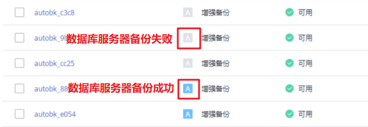

# 创建数据库服务器备份

云服务器备份在支持崩溃一致性备份的基础上，同时支持数据库备份。文件/磁盘数据在同一时间点，通过数据库备份内存数据，能够保证应用系统一致性，如包含MySQL或SAP HANA数据库的弹性云服务器。

## 约束与限制

-   暂不支持集群的应用一致性，如MySQL Cluster，只支持单个服务器上应用的一致性。
-   建议在业务量较小的时间段执行数据库备份。

## 操作步骤

1.  登录云备份管理控制台。
    1.  登录管理控制台。
    2.  单击管理控制台左上角的，选择区域和项目。
    3.  选择“存储 \> 云备份”。选择对应备份的页签。

2.  根据[购买云服务器备份存储库](https://support.huaweicloud.com/qs-cbr/cbr_02_0003.html)创建数据库备份规格的存储库。在数据库备份选项，需要勾选启用。
3.  将已安装Agent的云服务器，绑定至数据库备份类型的存储库上。
4.  根据[创建云服务器备份](https://support.huaweicloud.com/qs-cbr/cbr_02_0006.html)创建云服务器备份。
    -   若数据库服务器备份创建成功，则在备份列表中的备份名称可以旁边看到一个蓝色的“A”字样。
    -   若数据库服务器备份创建失败，则系统会自动创建服务器备份，同时存放于该数据库备份存储库中。在备份列表中的备份名称旁边可以看到一个灰色的“A”字样。可以在备份详情页中“管理信息”一栏查看数据库服务器备份失败的原因。如[图1](#fig1032823162519)所示。

        **图 1**  查看数据库服务器备份状态  
        

5.  根据页面提示，返回云服务器备份页面。若备份执行失败，可以根据任务页面的失败详情进行处理。

## 后续处理

当服务器中的数据库发生病毒入侵、故障等事件造成数据丢失时，可以参考[使用云服务器备份恢复数据](https://support.huaweicloud.com/usermanual-cbr/cbr_03_0032.html)和[使用备份创建镜像](https://support.huaweicloud.com/usermanual-cbr/cbr_03_0016.html)完成数据恢复。

