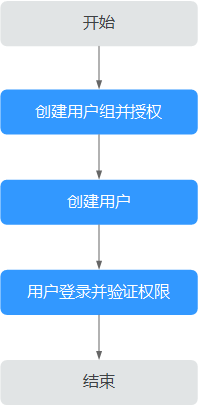

# 创建用户并授权使用CBR

如果您需要对您所拥有的CBR行精细的权限管理，您可以使用统一身份认证服务（Identity and Access Management，简称IAM），通过IAM，您可以：

-   根据企业的业务组织，在您的华为云账号中，给企业中不同职能部门的员工创建IAM用户，让员工拥有唯一安全凭证，并使用CBR资源。
-   根据企业用户的职能，设置不同的访问权限，以达到用户之间的权限隔离。
-   将CBR资源委托给更专业、高效的其他华为云账号或者云服务，这些账号或者云服务可以根据权限进行代运维。

如果华为云账号已经能满足您的要求，不需要创建独立的IAM用户，您可以跳过本章节，不影响您使用CBR服务的其它功能。

本章节为您介绍对用户授权的方法，操作流程如[图1](#fig194521431175317)所示。

## 前提条件

-   “CBR Viewer”属于策略，请先在IAM控制台中开通基于策略的访问控制公测，开通方法请参见：[申请基于策略的访问控制公测](https://support.huaweicloud.com/usermanual-iam/iam_01_019.html)。
-   给用户组授权之前，请您了解用户组可以添加的CBR系统策略，并结合实际需求进行选择，CBR支持的系统策略及策略间的对比，请参见：[CBR系统权限](https://support.huaweicloud.com/productdesc-cbr/cbr_01_0011.html)。若您需要对除CBR之外的其它服务授权，IAM支持服务的所有策略请参见[权限策略](https://support.huaweicloud.com/permissions/policy_list.html?product=cbr)。

## 示例流程

**图 1**  给用户授予CBR权限流程  

1.  [创建用户组并授权](https://support.huaweicloud.com/usermanual-iam/zh-cn_topic_0046611269.html)

    在IAM控制台创建用户组，并授予云备份只读权限“CBR Viewer”。

2.  [创建用户并加入用户组](https://support.huaweicloud.com/usermanual-iam/zh-cn_topic_0046611303.html)

    在IAM控制台创建用户，并将其加入[1](#li3656183032711)中创建的用户组。

3.  [用户登录](https://support.huaweicloud.com/usermanual-iam/iam_01_0552.html)并验证权限

    新创建的用户登录控制台，切换至授权区域，验证权限：

    -   在“服务列表”中选择云备份，进入CBR的云服务器备份，单击右上角“购买云服务器备份存储库”，尝试购买云服务器备份存储库，如果无法购买云服务器备份存储库，表示“CBR Viewer”已生效。
    -   在“服务列表”中选择除云备份外的任一服务，若提示权限不足，表示“CBR Viewer”已生效。

