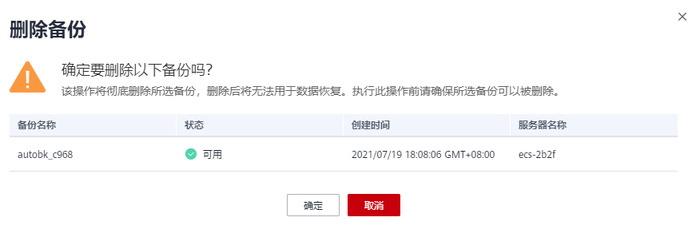

# 删除备份

用户可以根据实际情况删除无用的备份以节省空间和成本。

删除云上的混合云备份不会影响云下的备份，删除云下的混合云备份也不会影响云上已有的备份。

如果备份已创建过镜像，存在无法删除的情况。可以参考[删除镜像](https://support.huaweicloud.com/usermanual-ims/ims_01_0303.html)进行处理。

## 背景信息

云服务器备份支持两种方式删除备份：手动删除和过期自动删除。过期自动删除备份可以通过设置备份策略中的保留规则来实现，详情请参见[创建存储库备份策略](创建存储库备份策略.md)。

## 前提条件

-   至少存在一个备份。
-   备份的状态为“可用”或者“错误”。

## 操作步骤

1.  登录云备份管理控制台。
    1.  登录管理控制台。
    2.  单击管理控制台左上角的，选择区域和项目。
    3.  选择“存储 \> 云备份”。选择对应备份的页签。

2.  在任一个备份页面，选择“备份副本“页签，找到存储库和服务器所对应的备份，具体操作参见[查看备份](查看备份.md)。
3.  单击备份所在行的“删除“，如[图1](#fig1233612574363)所示，或批量勾选需要删除的备份，单击左上角的“删除”。

    **图 1**  删除备份  
    

    

4.  根据界面提示，单击“确定”。

## 后续处理

由于云备份的备份功能是基于整个磁盘备份，一些看不到的数据依然会被备份。删除备份后，如果磁盘此前进行过较多的增删改操作，会导致删除备份后存储库容量仍然占用较多。可以参考[如何减小备份占用空间？](https://support.huaweicloud.com/cbr_faq/cbr_06_0064.html)减少备份占用空间。

