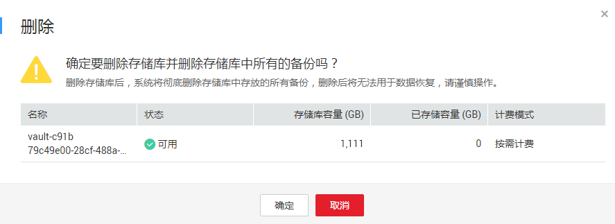

# 删除存储库

用户可以根据实际情况删除无用的存储库以节省成本。

删除操作仅针对按需付费模式的存储库，包年包月模式存储库需进行退订操作。

删除存储库时，会将存储库中存放的所有备份进行删除，请谨慎操作。

## 前提条件

-   至少存在一个存储库。
-   存储库的状态为“可用”或者“错误”。

## 操作步骤

1.  登录云备份管理控制台。
    1.  登录管理控制台。
    2.  单击管理控制台左上角的，选择区域和项目。
    3.  选择“存储 \> 云备份”。选择对应备份的页签。

2.  在任一个备份页面，找到目标存储库，单击目标存储库所在行的“更多 \> 删除”。如[图1](#fig67842014205811)所示。删除存储库时，会将存储库中存放的所有备份进行删除，请谨慎操作。

    **图 1**  删除存储库  
    

3.  单击“确定”，系统会将存储库进行删除。

