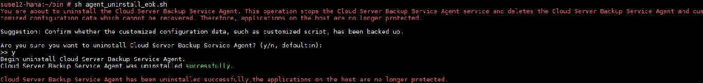
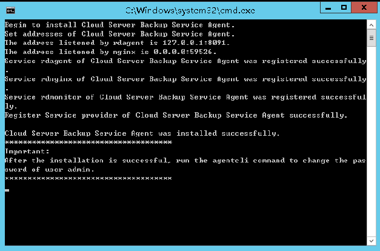

# 卸载Agent

## 操作场景

该任务指导用户在不需要启用数据库备份功能时，卸载Agent。

## 前提条件

已获取弹性云服务器的登录帐号和密码。

## 卸载Linux版本Agent

1.  登录需要卸载Agent的弹性云服务器，并执行**su -root**命令切换到**root**用户。
2.  在/home/rdadmin/Agent/bin目录下执行以下命令，卸载Agent。如[图1](#fig14815872814)所示。若出现绿色卸载成功字样，表示Agent卸载成功。

    **sh agent\_uninstall\_ebk.sh**

    **图 1**  卸载Linux Agent成功  
    

## 卸载Windows版本Agent

1.  登录需要卸载Agent的弹性云服务器。
2.  在安装目录的bin目录下选中**agent\_uninstall\_ebk.bat**双击打开，卸载Agent。

    系统卸载Agent完成后，弹窗自动关闭，卸载成功。如[图2](#fig168441252195513)所示。

    **图 2**  卸载Windows Agent成功  
    

