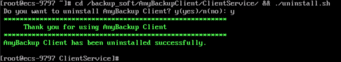
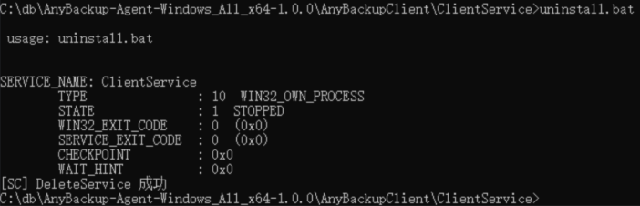

# 卸载客户端<a name="cbr_03_0133"></a>

## 操作场景<a name="section191221514511"></a>

该任务指导用户在不需要启用应用备份功能时，在本地服务器上卸载客户端。

## 卸载Linux系统客户端<a name="section557045714116"></a>

1.  登录需要卸载客户端的本地服务器，并执行**su -root**命令切换到**root**用户。
2.  在执行以下命令卸载客户端。如[图1](#fig14815872814)所示。若出现卸载成功字样，表示客户端卸载成功。

    ```
    cd /backup_soft/AnyBackupClient/ClientService/ && ./uninstall.sh
    ```

    **图 1**  卸载Linux 客户端成功<a name="fig14815872814"></a>  
    


## 卸载Windows系统客户端<a name="section13571155719119"></a>

1.  登录需要卸载客户端的本地服务器。
2.  通过CMD命令行进入安装目录中的\\AnyBackupClient\\ClientService\\路径。执行**uninstall.bat**，卸载客户端。

    系统卸载客户端完成后，出现卸载成功字样，表示客户端卸载成功。如[图2](#fig168441252195513)所示。

    **图 2**  卸载Windows 客户端成功<a name="fig168441252195513"></a>  
    


