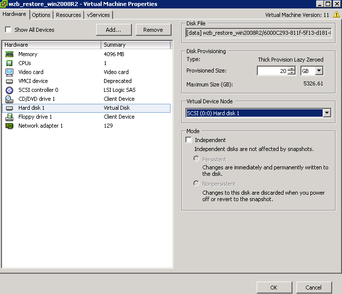

# 增加VMware受保护环境

eBackup备份管理系统支持对VMware环境下虚拟机的保护。您需要在系统中增加VMware受保护环境，从而对受保护环境中的虚拟机进行备份和恢复。

## 背景信息

-   增加VMware受保护环境时，如果虚拟机名称中包含%/\\-."等特殊字符，在eBackup备份管理系统中，该虚拟机显示的名称与原名称不一致，如%将显示为%25。详细内容请参见《vSphere Web Services SDK Programming Guide》。为方便起见，建议用户在对VMware虚拟机命名时避免使用上述特殊字符。
-   要备份的VMware虚拟机的系统盘必须是在0号槽位，否则备份上云后，系统盘的备份副本会显示为数据盘。因此，在备份前，请确保系统盘在0号槽位，具体方法如下，此处以VMware vSphere 6.0版本为例进行说明，其他版本操作界面可能会有差异，请以实际环境为准。
    1.  登录VMware vSphere web Client，并查找到需要备份的虚拟机。
    2.  单击“Summary \> Edit Settings“。
    3.  单击系统盘，如果“Virtual Device Node“显示为“SCSI \(0:0\)“，则表示系统盘在0号槽位。否则请修改“Virtual Device Node“的值为“SCSI \(0:0\)“。

        **图 1**  确认系统盘槽位  
        

## 前提条件

-   服务器和VMware的管理平面网络连接正常。
-   服务器的“可访问状态”为“可访问”，“注册状态”为“已注册”。查看服务器相关信息的操作请参见[管理eBackup服务器](管理eBackup服务器.md#cbr_03_0093)。

## 操作步骤

1.  以“admin”帐号登录eBackup备份管理系统。

    详细信息请参见[登录eBackup](登录eBackup.md#cbr_03_0092)。

2.  在导航栏上选择“  \> VMware”。
3.  单击“受保护环境”区域的图标。
4.  设置VMware受保护环境基本信息，相关参数说明如[表1](#zh-cn_topic_0174982619_zh-cn_topic_0170955450_table215761834713)所示。

    **图 2**  增加受保护环境  
    

    **表 1**  VMware受保护环境参数说明

    
    <table><thead align="left"><tr id="zh-cn_topic_0174982619_zh-cn_topic_0170955450_row111531318124716"><th class="cellrowborder" valign="top" width="14.288571142885711%" id="mcps1.2.4.1.1">
参数名称

    </th>
    <th class="cellrowborder" valign="top" width="42.74572542745725%" id="mcps1.2.4.1.2">
参数说明

    </th>
    <th class="cellrowborder" valign="top" width="42.96570342965704%" id="mcps1.2.4.1.3">
设置原则

    </th>
    </tr>
    </thead>
    <tbody><tr id="zh-cn_topic_0174982619_zh-cn_topic_0170955450_row1015418181473"><td class="cellrowborder" valign="top" width="14.288571142885711%" headers="mcps1.2.4.1.1 ">
名称

    </td>
    <td class="cellrowborder" valign="top" width="42.74572542745725%" headers="mcps1.2.4.1.2 ">
用户自定义的受保护环境名称。

    </td>
    <td class="cellrowborder" valign="top" width="42.96570342965704%" headers="mcps1.2.4.1.3 ">
名称长度范围为1到128位，只能由字母、数字、中文字符、“+”、“_”、“-”、“.”、“@”组成。

    </td>
    </tr>
    <tr id="zh-cn_topic_0174982619_zh-cn_topic_0170955450_row191551182470"><td class="cellrowborder" valign="top" width="14.288571142885711%" headers="mcps1.2.4.1.1 ">
vCenter/ESXi IP

    </td>
    <td class="cellrowborder" valign="top" width="42.74572542745725%" headers="mcps1.2.4.1.2 "><ul id="zh-cn_topic_0174982619_zh-cn_topic_0170955450_ul3154151814477"><li>当由vCenter Server统一管理虚拟机时，请输入vCenter Server的IP地址。</li><li>当由独立的ESXi主机管理虚拟机时，请输入ESXi主机的管理IP地址。</li></ul>
    
 说明： 

ESXi主机未被任何vCenter Server管理。

    

    </td>
    <td class="cellrowborder" rowspan="3" valign="top" width="42.96570342965704%" headers="mcps1.2.4.1.3 ">
请向VMware管理员获取。

    </td>
    </tr>
    <tr id="zh-cn_topic_0174982619_zh-cn_topic_0170955450_row16155131834716"><td class="cellrowborder" valign="top" headers="mcps1.2.4.1.1 ">
用户名

    </td>
    <td class="cellrowborder" valign="top" headers="mcps1.2.4.1.2 ">
登录VMware vSphere web Client的用户名。

    </td>
    </tr>
    <tr id="zh-cn_topic_0174982619_zh-cn_topic_0170955450_row161554189478"><td class="cellrowborder" valign="top" headers="mcps1.2.4.1.1 ">
密码

    </td>
    <td class="cellrowborder" valign="top" headers="mcps1.2.4.1.2 ">
登录VMware vSphere web Client的密码。

    </td>
    </tr>
    <tr id="zh-cn_topic_0174982619_zh-cn_topic_0170955450_row215515182477"><td class="cellrowborder" valign="top" width="14.288571142885711%" headers="mcps1.2.4.1.1 ">
协议

    </td>
    <td class="cellrowborder" valign="top" width="42.74572542745725%" headers="mcps1.2.4.1.2 ">
eBackup备份管理系统与vCenter Server或者ESXi主机管理平面通信的网络协议。支持安全协议“HTTPS”。

    </td>
    <td class="cellrowborder" valign="top" width="42.96570342965704%" headers="mcps1.2.4.1.3 ">
-

    </td>
    </tr>
    <tr id="zh-cn_topic_0174982619_zh-cn_topic_0170955450_row171561118144717"><td class="cellrowborder" valign="top" width="14.288571142885711%" headers="mcps1.2.4.1.1 ">
端口

    </td>
    <td class="cellrowborder" valign="top" width="42.74572542745725%" headers="mcps1.2.4.1.2 ">
eBackup备份管理系统与vCenter Server或者ESXi主机管理平面通信的端口号。

    </td>
    <td class="cellrowborder" valign="top" width="42.96570342965704%" headers="mcps1.2.4.1.3 ">
默认端口号为443。

    </td>
    </tr>
    <tr id="zh-cn_topic_0174982619_zh-cn_topic_0170955450_row1415719185475"><td class="cellrowborder" valign="top" width="14.288571142885711%" headers="mcps1.2.4.1.1 ">
证书

    </td>
    <td class="cellrowborder" valign="top" width="42.74572542745725%" headers="mcps1.2.4.1.2 ">
该证书用于验证受保护环境的信息。

    <ul id="zh-cn_topic_0174982619_zh-cn_topic_0170955450_ul315651864719"><li>自动匹配
如果已在证书统一管理界面（“ &gt; 证书”）导入了受保护环境的证书，可自动匹配合适的已导入证书。

    </li><li>手动导入
证书获取方式，以下任选其一：

    <ul id="zh-cn_topic_0174982619_zh-cn_topic_0170955450_ul1115691810475"><li>向VMware管理员获取。</li><li>使用浏览器登入VMware vCenter环境，单击“下载受信任的根CA证书”，下载证书压缩包至本地任意目录。下载后，证书压缩包文件类型修改为“.zip”格式，修改完成后，打开证书压缩文件，查找“*.0”格式文件，并修改其文件类型为“*.crt”格式。</li></ul>
    </li></ul>
    </td>
    <td class="cellrowborder" valign="top" width="42.96570342965704%" headers="mcps1.2.4.1.3 ">
建议导入有效的CA根证书，否则备份管理系统将无法验证受保护环境信息，安全性存在风险。为了保证和受保护环境的兼容性，eBackup备份管理系统不限制证书支持的协议版本。

    
证书请向VMware管理员获取。

    </td>
    </tr>
    </tbody>
    </table>

5.  单击“确定”。

    > **说明：**   
    >-   增加受保护环境时，系统会自动获取虚拟机的相关信息。导航树结构和受保护环境中保持一致。  
    >-   受保护环境增加成功后，系统自动在左侧导航树中的受保护环境名称后面增加vCenter Server或ESXi主机的IP地址，方便用户根据IP地址信息快速定位受保护环境。  
    >-   首次增加受保护环境时，系统将自动扫描受保护环境信息。用户可以进入“  \> 任务”查看扫描任务进度。  
    >    如果受保护环境信息扫描成功，则一级节点旁边的图标显示为，同时本次扫描的日期和时间将显示在扫描任务图标的标签中。如果受保护环境信息扫描失败或者还未扫描完成，则一级节点旁边的图标显示为，同时最近一次扫描成功的日期和时间将显示在扫描任务图标的标签中。  
    >-   eBackup备份管理系统默认间隔一小时自动扫描受保护环境信息。当受保护环境信息有变更时，用户也可以通过单击每个一级节点旁边的图标/手动触发扫描任务。  
    >-   扫描完成后用户可以单击“受保护环境”区域的图标刷新左侧导航树显示信息。  

## 后续处理

用户需要将想要保护的虚拟机增加到保护集中，才能对其进行备份等操作。勾选需要保护的虚拟机，单击“增加到已有保护集”或“增加到新建保护集”，可以将其增加到保护集中。

