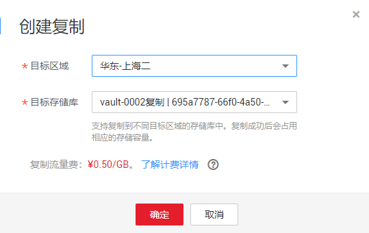

# 复制存储库

云服务器备份和混合云备份，支持将整个存储库的备份复制到另一区域的复制存储库中。后续可在另一个区域使用复制的备份数据创建镜像，并发放新的云服务器。

复制存储库主要有以下两种复制方式：

-   选中某一个备份存储库，手动执行一次复制。
-   配置存储库的复制策略，周期性的对策略产生的未向目标区域进行过复制或复制失败的备份执行复制操作。

## 约束与限制

-   单个备份的复制速率为80MB/s左右，最多支持八个备份同时复制。
-   支持复制到多个目标区域的存储库中，复制成功后会占用相应的存储容量。
-   存储库中包含同时满足以下条件的备份才能执行创建复制操作：
    1.  备份由弹性云服务器产生。
    2.  备份数据包含系统盘。
    3.  备份状态为“可用”。

-   仅支持对本区域生成的备份存储库执行复制操作，不支持对复制操作产生的复制存储库再次执行复制操作，从其他区域复制而来的备份仅可用于创建镜像。
-   一个备份存储库可以分别复制到不同的目标区域。向一个目标区域复制的次数在不同的复制方式下有所不同：
    -   对备份存储库手动创建复制：在目标区域将目标复制存储库中的备份删除后可再次复制。
    -   通过策略复制：每个目标区域仅能复制一次，即使将目标备份删除后也不允许再次复制。

-   仅支持向具备复制能力的目标区域复制备份存储库。

## 操作步骤

1.  登录云备份管理控制台。
    1.  登录管理控制台。
    2.  单击管理控制台左上角的，选择区域和项目。
    3.  单击，选择“存储 \> 云备份 \> 云服务器备份”或“存储 \> 云备份 \> 混合云备份”。

2.  选择“存储库“页签，找到目标备份存储库。
3.  单击目标存储库所在行的“更多 \> 创建复制”，如[图1](#fig6867058144918)所示。

    **图 1**  创建存储库复制  
    

4.  在弹出的创建复制的窗口中配置复制的相关信息，如[表1](#table4829135361311)所示。

    **表 1**  复制参数说明

    
    <table><thead align="left"><tr id="row148305532138"><th class="cellrowborder" valign="top" width="19%" id="mcps1.2.3.1.1">
参数

    </th>
    <th class="cellrowborder" valign="top" width="81%" id="mcps1.2.3.1.2">
说明

    </th>
    </tr>
    </thead>
    <tbody><tr id="row2014994311204"><td class="cellrowborder" valign="top" width="19%" headers="mcps1.2.3.1.1 ">
目标区域

    </td>
    <td class="cellrowborder" valign="top" width="81%" headers="mcps1.2.3.1.2 ">
选择备份数据需要复制到的目标区域。

    
只有具备复制能力的区域才会在目标区域中展示。

    <ul id="ul649081582612"><li>如果所选区域只有一个项目，则直接选择区域名称即可。</li><li>如果所选区域有多个项目，默认选择该区域下的主项目，也可以根据需要选择其他项目。</li></ul>
    </td>
    </tr>
    <tr id="row544633365118"><td class="cellrowborder" valign="top" width="19%" headers="mcps1.2.3.1.1 ">
目标存储库

    </td>
    <td class="cellrowborder" valign="top" width="81%" headers="mcps1.2.3.1.2 ">
需要选择在目标区域的复制存储库。

    </td>
    </tr>
    </tbody>
    </table>

5.  单击“确定“，完成复制任务的创建。
6.  创建完成后，可切换到目标区域（项目）查看目标存储库中的备份，具体操作参见[查看存储库](查看存储库.md)。后续可根据需要使用该存储库中的备份创建镜像。

