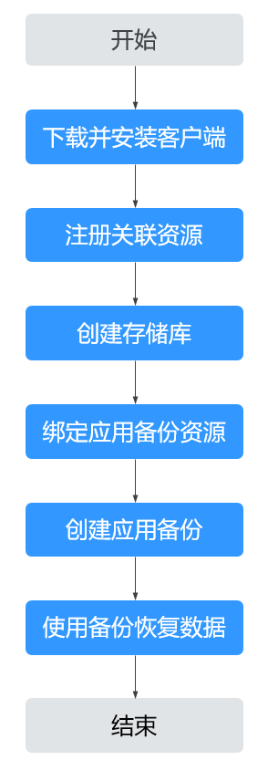

# 应用备份操作流程

应用备份操作流程如[图1](#fig2797188183412)所示。

**图 1**  应用备份操作流程  

1.  下载并安装客户端：

    进行应用备份前需要先在目标主机上下载和安装客户端，相关操作请参见[下载和安装客户端](下载和安装客户端.md)。安装完成后，云备份系统会自动发现已安装客户端的主机，显示在“已安装的客户端”列表中。

2.  注册关联资源：

    在备份之前，需要先在对应的备份界面，注册需备份的文件集或数据库。相关操作请参见[注册备份资源](注册备份资源.md)。

3.  创建存储库：

    创建用于存放应用备份的存储库，选择是否将需备份的文件集或数据库绑定至存储库上。相关操作请参见[创建应用备份存储库](创建应用备份存储库.md)。

4.  绑定应用备份资源：

    如果购买存储库时未绑定资源，还需要将资源绑定至存储库，请参见[绑定应用备份资源](绑定应用备份资源.md)。

5.  创建应用备份：

    可为资源创建手动备份和自动备份，备份将存放在存储库中。相关操作请参见[创建应用备份](创建应用备份.md)。

6.  使用备份恢复数据：

    可以使用云上备份将数据恢复至原服务器或新服务器均可。相关操作请参见[使用应用备份恢复数据](使用应用备份恢复数据-0.md)。

