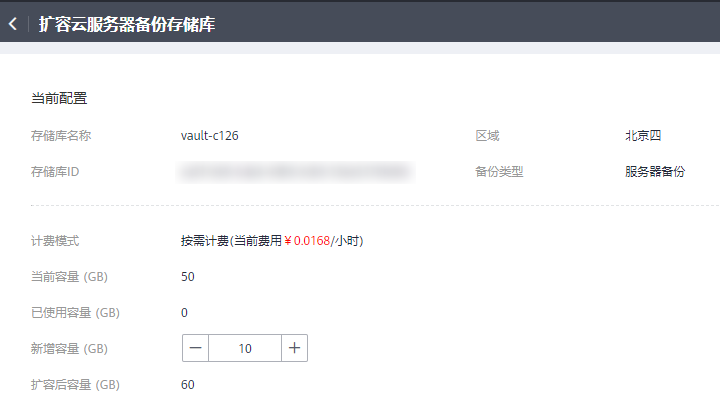

# 扩容存储库

当用户认为存储库的总容量不足时，可以通过执行扩容操作来增加存储库的容量。

## 操作步骤

1.  登录云备份管理控制台。
    1.  登录管理控制台。
    2.  单击管理控制台左上角的，选择区域和项目。
    3.  选择“存储 \> 云备份”。选择对应备份的页签。

2.  在任一备份页面，找到目标存储库，单击存储库所在列的“更多 \> 扩容”。如[图1](#fig624235516355)所示。

    **图 1**  扩容存储库  
    

    

3.  输入需要新增的容量。最小值为1GB。
4.  单击“立即申请”。确认信息无误后，单击“提交”。系统会自动为存储库扩容。
5.  返回存储库列表，可以看到存储库已成功扩容。

## 自动扩容

如果希望存储库在容量达到上限时，自动进行扩容，可以开启自动扩容功能。

开启自动扩容后，当存储库的已存储容量超过上限时，存储库将自动扩容至原存储库容量的1.25倍。

计费模式为“包年包月”的存储库不支持开启自动扩容。

1.  登录云备份管理控制台。
    1.  登录管理控制台。
    2.  单击管理控制台左上角的，选择区域和项目。
    3.  选择“存储 \> 云备份”。选择对应备份的页签。

2.  在任一备份页面，找到目标存储库，单击目标存储库名称。
3.  在存储库详情页面，找到“自动扩容”，编辑自动扩容状态，修改为开启。
4.  （可选）如不再需要自动扩容功能，编辑自动扩容状态，修改为关闭即可。

