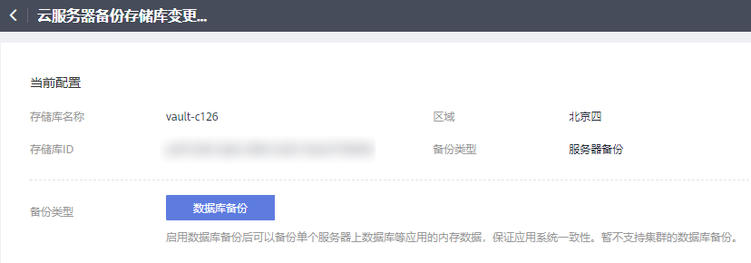

# 更改存储库规格

云服务器备份的备份存储库和复制存储库分为两种规格，分别为服务器备份和数据库备份。

-   服务器备份：仅用于存放普通备份。
-   数据库备份：仅存放含有数据库的服务器产生的备份。

如果您需要备份含有数据库的服务器，需要将目标存储库的规格由服务器备份变更为数据库备份。变更规格的具体操作，请参见本节内容。

只能将规格为“服务器备份”的存储库变更为“数据库备份”，不能将规格为“数据库备份”的存储库变更为“服务器备份”。

## 操作步骤

1.  登录云备份管理控制台。
    1.  登录管理控制台。
    2.  单击管理控制台左上角的，选择区域和项目。
    3.  选择“存储 \> 云备份”。选择对应备份的页签。

2.  在云服务器备份页面，找到目标存储库。在存储库所在行，单击“更多 \> 变更规格”。如[图1](#fig1554418426122)所示。

    **图 1**  变更规格  
    

    

3.  “备份类型”选择“数据库备份”。单击“立即申请”。
4.  单击“去支付”，根据信息完成操作。系统将自动变更存储库规格。

