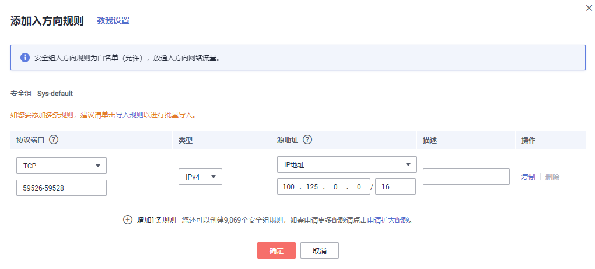
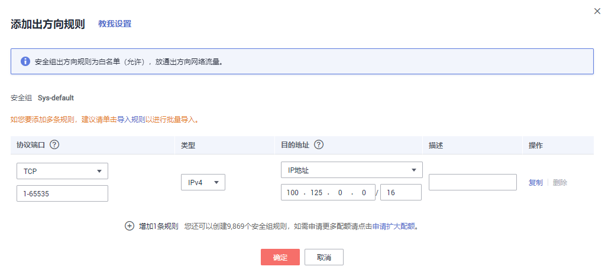

# 更改安全组

## 背景说明

安全组是一个逻辑上的分组，为同一个虚拟私有云VPC内具有相同安全保护需求并相互信任的弹性云服务器提供访问策略。安全组创建后，用户可以在安全组中定义各种访问规则，当弹性云服务器加入该安全组后，即受到这些访问规则的保护。安全组的默认规则是在出方向上的数据报文全部放行，安全组内的弹性云服务器无需添加规则即可互相访问。系统会为每个云帐号默认创建一个默认安全组，用户也可以创建自定义的安全组。

当创建安全组时，需要用户添加对应的入方向和出方向访问规则，放通启用数据库备份需要的端口，以免数据库备份失败。

## 操作说明

使用数据库备份前需要先更改安全组。云服务器备份为了您的网络安全考虑，在使用前未设置安全组入方向，需要您手动进行配置。

安全组的出方向需要设置允许100.125.0.0/16网段的1-65535端口，入方向需要设置允许100.125.0.0/16网段的59526-59528端口。出方向规则默认为0.0.0.0/0，即数据报文全部放行。若未修改出方向默认规则，则无需重新设置。

## 操作步骤

1.  登录弹性云服务器控制台。
    1.  登录管理控制台。
    2.  单击管理控制台左上角的，选择区域和项目。
    3.  选择“计算 \> 弹性云服务器”。

2.  单击左侧导航树中的“弹性云服务器”或“裸金属服务器”，在服务器界面选择目标服务器。进入目标服务器详情。
3.  选择“安全组“页签，选择目标安全组，弹性云服务器界面单击列表右侧“更改安全组规则“。裸金属服务器单击“更改安全组“，在弹出框中单击“管理安全组“。
4.  在安全组界面，选择“入方向规则“页签，单击“添加规则“，弹出“添加入方向规则“对话框，如[图1](#fig325675335215)所示。选择“TCP”协议，在“端口“中输入“59526-59528”，在源地址中选择“IP地址“，输入“100.125.0.0/16”。适当补充描述后，单击“确定“，完成入方向规则设置。

    **图 1**  添加入方向规则  
    

5.  选择“出方向规则“页签，单击“添加规则“，弹出“添加出方向规则“对话框，如[图2](#fig12673419116)所示。选择“TCP”协议，在“端口“中输入“1-65535”，在目的地址中选择“IP地址“，输入“100.125.0.0/16”。适当补充描述后，单击“确定“，完成出方向规则设置。

    **图 2**  添加出方向规则  
    

