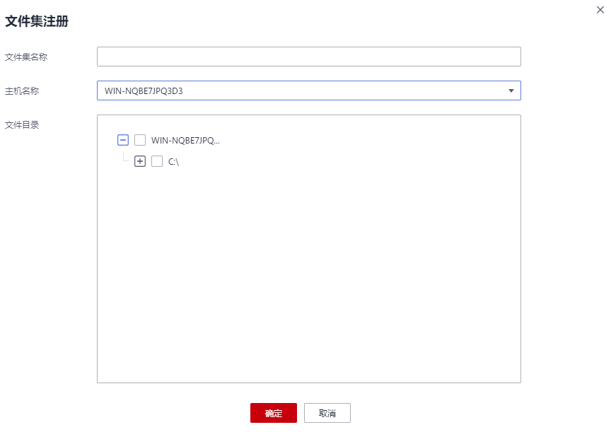
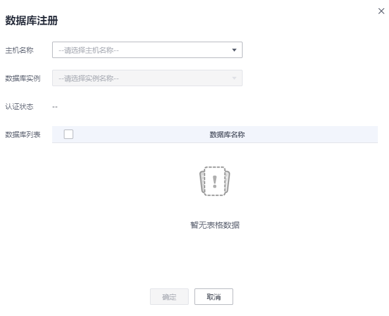

# 注册备份资源

## 场景说明

完成安装客户端后，云备份系统会自动识别已安装客户端的服务器或虚拟机，并显示在“应用备份 \> 客户端 \> 已安装的客户端”中。

云备份只能注册已识别的主机中需备份的资源，完成资源注册后才能进行备份。

## 文件集注册

1.  登录弹性云服务器控制台。
    1.  登录管理控制台。
    2.  单击管理控制台左上角的，选择区域和项目。
    3.  选择“存储 \> 云备份 \> 应用备份 \> 文件集备份 \> 文件集”。

2.  单击“注册”，进入注册页面。如[图1](#fig18996163110111)所示。

    **图 1**  注册文件集  
    

3.  输入文件集名称。

    只能由中文字符、英文字母、数字、下划线、中划线组成，且长度小于等于64个字符。

4.  在下拉列表中选择已关联的主机。如果目标主机未在列表中，需要前往“应用备份 \> 客户端 \> 已安装的客户端”页面确认主机是否为“在线”状态，如果主机已不在线，需要重新进行关联和认证主机。
5.  勾选需要备份的文件和文件目录，确认信息无误后，单击“确定”，完成文件集注册。

## 数据库注册

1.  登录弹性云服务器控制台。
    1.  登录管理控制台。
    2.  单击管理控制台左上角的，选择区域和项目。
    3.  选择“存储 \> 云备份 \> 应用备份 \> 数据库备份 \> 数据库”。

2.  单击“注册”，进入注册页面。如[图2](#fig561117284215)所示。

    **图 2**  注册数据库  
    

3.  在下拉列表中选择已关联的主机。如果目标主机未在列表中，需要前往“应用备份 \> 客户端 \> 已安装的客户端”页面确认主机是否为“在线”状态，如果主机已不在线，需要重新进行关联和认证主机。
4.  在下拉列表中选择主机中存在的实例。
5.  需要完成身份认证，完成后才能获取数据库列表。
    -   选择“SQL Server身份认证”，输入数据库的用户名和密码，单击“连接认证”，确认实例与云备份的连通性正常，完成认证实例。
    -   选择“操作系统身份认证”，单击“连接认证”，确认实例与云备份的连通性正常，完成认证实例。

6.  勾选需要备份的数据库，确认信息无误后，单击“确定”，完成数据库注册。

