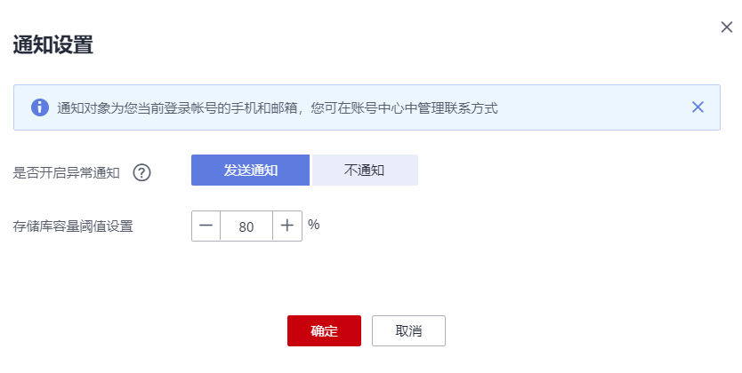

# 消息通知

## 功能说明

消息通知服务（Simple Message Notification，SMN）是可靠的、可扩展的、海量的消息处理服务。它可以依据用户的需求主动推送通知消息，最终用户可以通过短信、电子邮件、应用等方式接收。用户也可以在应用之间通过SMN实现应用的功能集成，降低系统的复杂性。

云备份依赖消息通知服务提供消息通知功能，您可以自主设置是否开启消息通知。开启消息通知功能，可以了解以下内容：

-   存储库存储容量的情况
-   存储库是否绑定已激活的策略或资源
-   备份是否执行失败
-   自动绑定资源的执行情况
-   是否存在冻结存储库

如果您不需要以上内容的消息通知，可以选择不启用消息通知，则所有的消息通知均会关闭。如您需要单独开通某项告警通知，可以参考[创建告警规则](创建告警规则.md)开启告警通知。

短信和邮件发送会存在延时的情况，当日识别到问题后可能最长次日才会收到备份失败的短信或邮件。如您当日已对问题进行处理，并且确认无异常，您可以忽略次日的短信或邮件的提醒。

## 操作步骤

1.  登录云备份管理控制台。
    1.  登录管理控制台。
    2.  单击管理控制台左上角的，选择区域和项目。
    3.  选择“存储 \> 云备份 \> 任务”。

2.  单击右上角“通知设置”。设置存储库容量阈值通知，参考以下参数说明进行配置。如[图1](#fig764320551983)所示。

    是否开启异常通知：

    -   发送通知：同时需要设置存储库容量阈值。存在存储库容量达到阈值的情况下，系统将会向帐号中心设置的手机号和邮箱发送消息，提醒您存在存储库容量达到阈值。除存储库容量阈值通知外，其他包含在消息通知的情况均会产生通知。如您收到消息，可以参考“总览”页面右侧“消息通知”部分的内容进行处理。
    -   不通知：系统将不会自动向帐号中心设置的手机号和邮箱发送消息。

        **图 1**  设置通知  
        

3.  单击“确定”，完成设置。

    设置成功后，您可以随时更改消息通知的情况。

