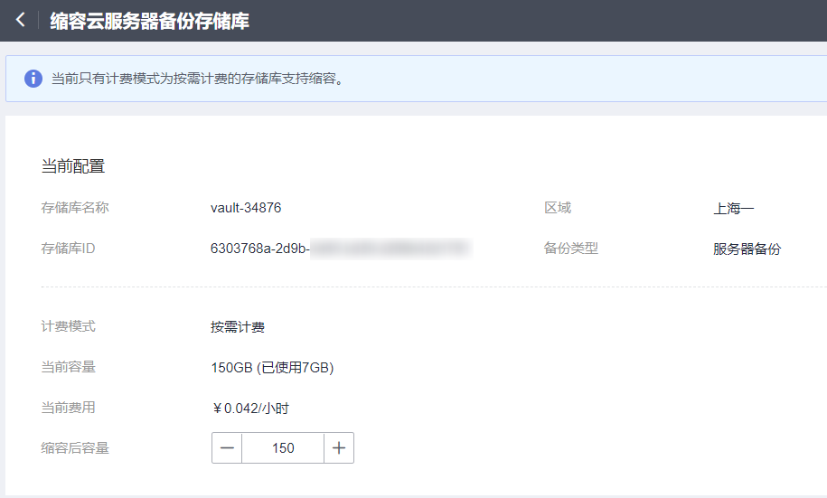

# 缩容存储库

当用户认为存储库的总容量过大时，可以通过执行缩容操作来减小存储库的容量。

目前只有按需计费的存储库支持缩容。

## 操作步骤

1.  登录云备份管理控制台。
    1.  登录管理控制台。
    2.  单击管理控制台左上角的，选择区域和项目。
    3.  选择“存储 \> 云备份”。选择对应备份的页签。

2.  在任一备份页面，找到目标存储库，单击存储库所在列的“更多 \> 缩容”。如[图1](#fig624235516355)所示。

    **图 1**  缩容存储库  
    

    

3.  输入缩容后的容量。缩容后的容量不能小于已使用的容量。
4.  单击“立即申请”。确认信息无误后，单击“提交”。系统会自动为存储库缩容。
5.  返回存储库列表，可以看到存储库已成功缩容。

