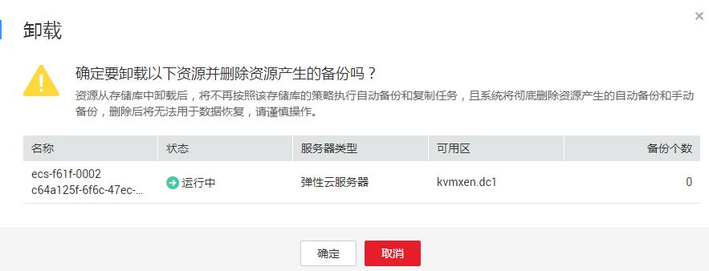

# 解绑资源

当绑定的服务器或磁盘不再需要备份时，可以从存储库中解绑。

资源从存储库中解绑后，将不再按照该存储库的策略执行自动备份和复制任务，且系统将彻底删除资源产生的自动备份和手动备份，删除后将无法用于数据恢复，请谨慎操作。

## 操作步骤

1.  登录云备份管理控制台。
    1.  登录管理控制台。
    2.  单击管理控制台左上角的，选择区域和项目。
    3.  单击，选择“存储 \> 云备份”。

2.  在任一个备份页面，找到目标存储库，单击目标存储库名称。
3.  选择“绑定的服务器”页签。找到目标服务器，单击“解绑”。如[图1](#fig1376320199159)所示。

    资源从存储库中解绑后，将不再按照该存储库的策略执行自动备份和复制任务，且系统将彻底删除资源产生的自动备份和手动备份，删除后将无法用于数据恢复，请谨慎操作。

    **图 1**  解绑服务器  
    

4.  确认信息无误后，单击“确定”。

