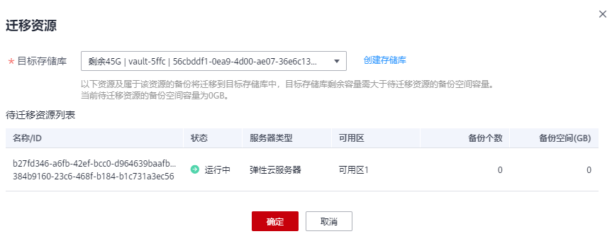

# 迁移资源

通过迁移资源功能，您可以将某个资源从当前存储库中解绑并重新绑定至另一存储库，该资源产生的所有备份也会从当前存储库迁移至目标存储库中。

## 约束限制

-   只有“可用”状态的存储库才能进行资源迁移。
-   只有规格相同的存储库才能进行资源迁移。
-   目标存储库剩余容量需大于待迁移资源的备份总容量。
-   暂不支持跨帐号迁移存储库资源。

## 操作步骤

1.  登录云备份管理控制台。
    1.  登录管理控制台。
    2.  单击管理控制台左上角的，选择区域和项目。
    3.  选择“存储 \> 云备份”。选择对应备份的页签。

2.  在任一个备份页面，找到目标存储库，单击目标存储库名称。
3.  选择“绑定的服务器”页签。找到目标服务器，单击“迁移”。如[图1](#fig127546043412)所示。

    **图 1**  迁移资源  
    

    

4.  选择目标存储库，单击“确定”。
5.  在“任务”中查看迁移进度，如果“状态”变为“成功”，则表示资源迁移成功。
6.  此时资源已绑定至目标存储库且所属备份也已全部迁移至目标存储库中，可以前往目标存储库进行查看。

